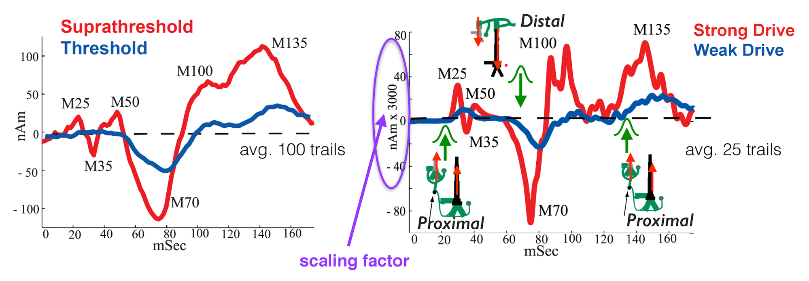
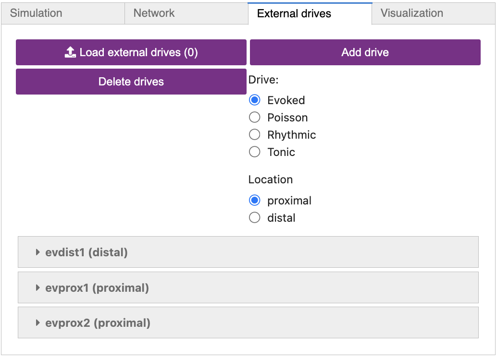
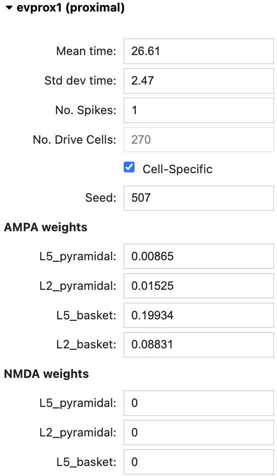
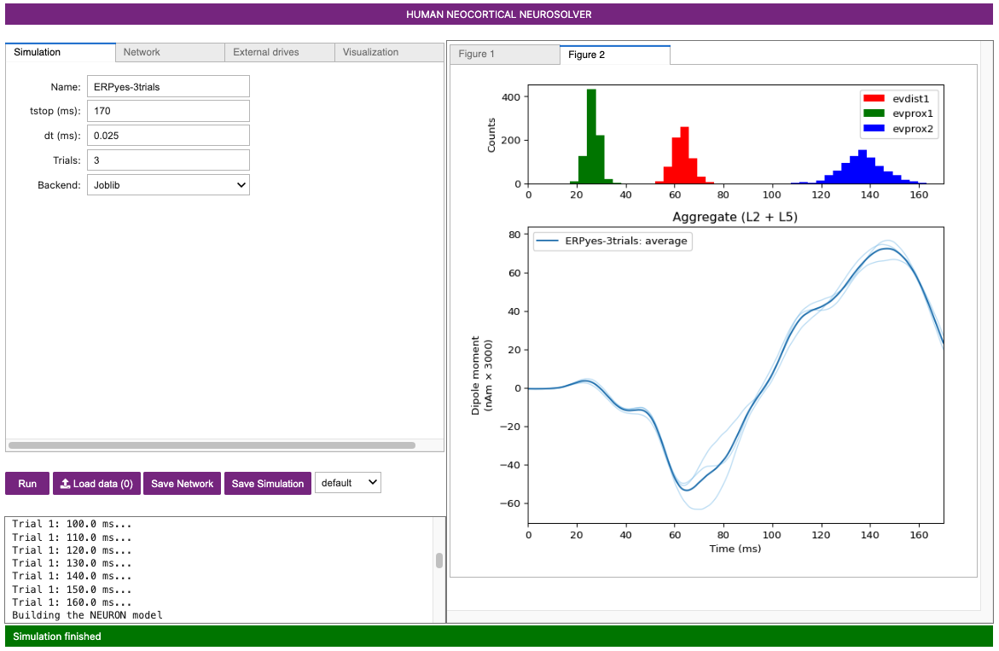
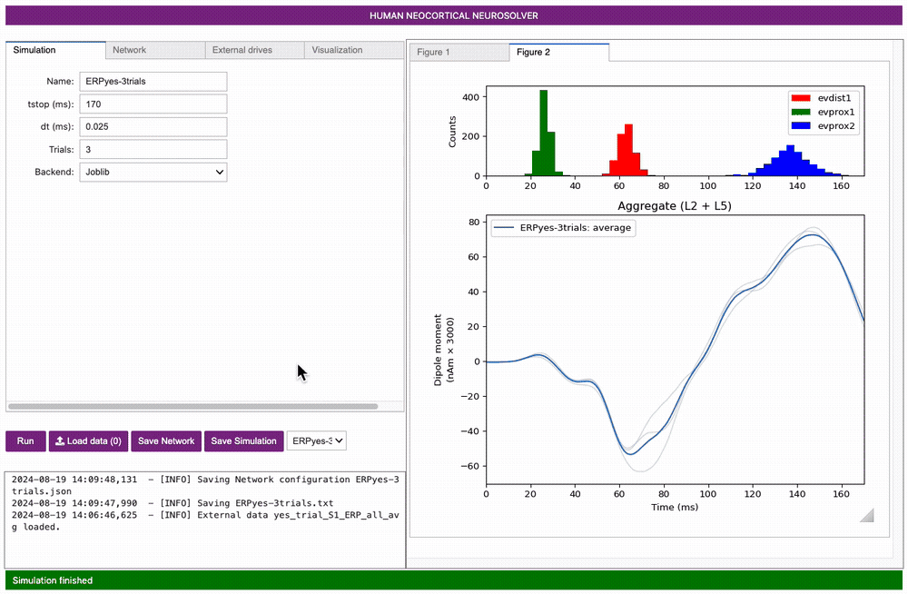
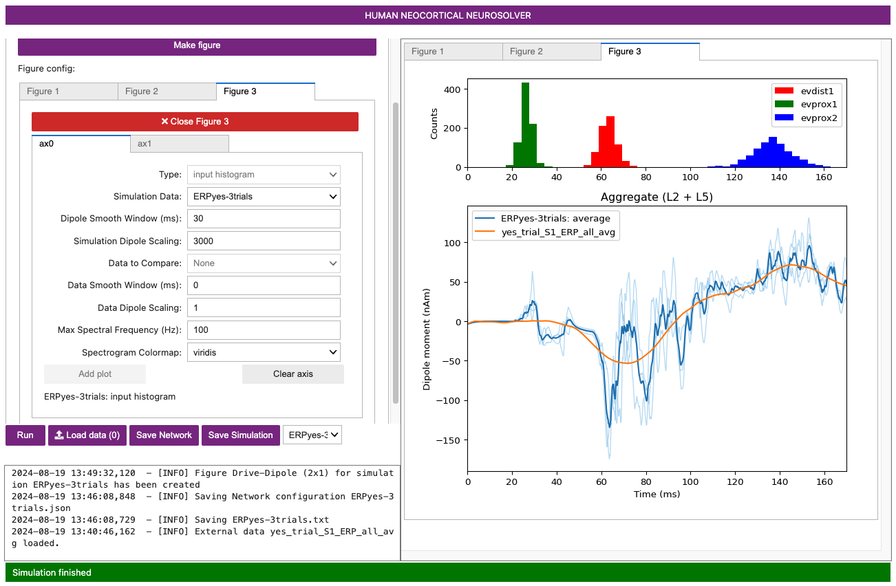
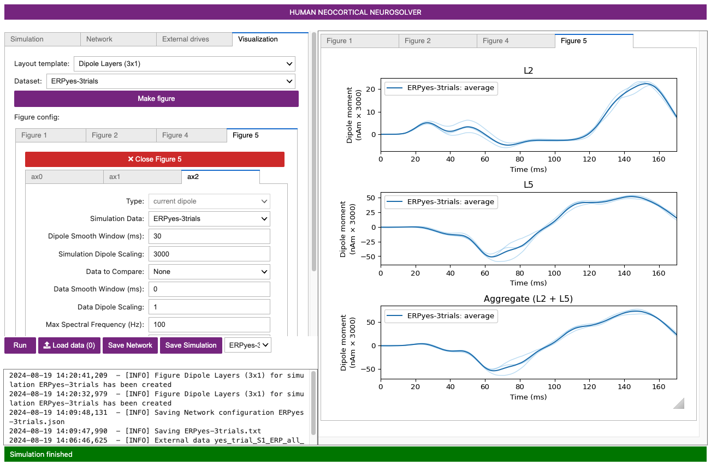
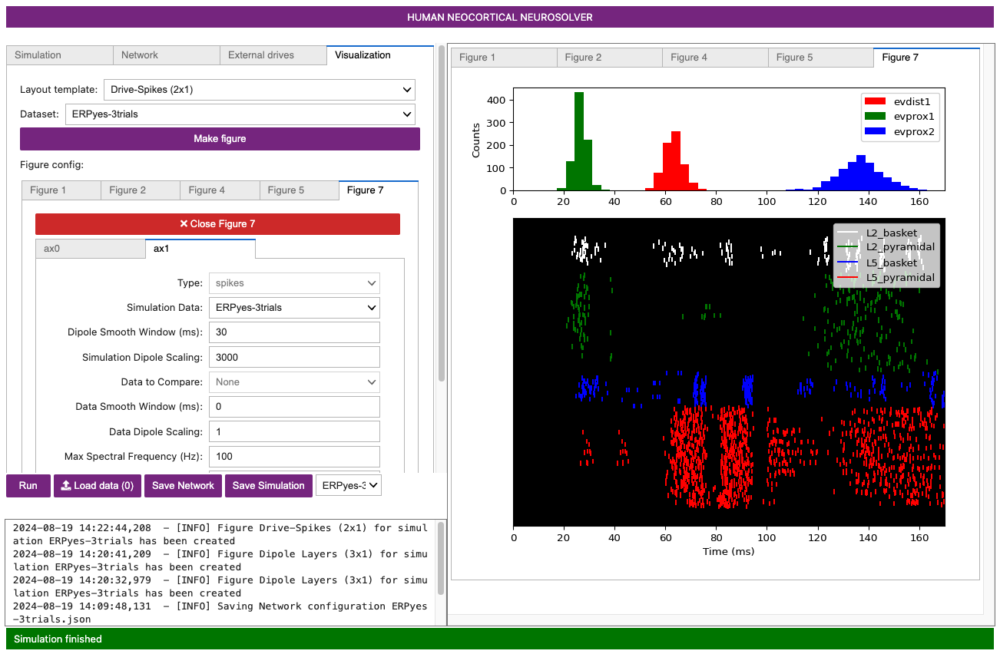

# Event Related Potentials (ERPs)

## Getting Started

In order to understand the workflow and initial parameter sets provided with this tutorial, we must first briefly describe prior studies that led to the creation of the provided data and evoked response parameter set that you will work with. This tutorial is based on results from our 2007 study where we recorded and simulated tactile evoked responses source localized to the primary somatosensory cortex (SI) [1].

In our 2007 study, we investigated the early evoked activity (0-175 ms) elicited by a brief tap to the D3 digit and source localized to an an equivalent current dipole in the contralateral hand area of the primary somatosensory cortex (SI) [1]. The strength of the tap was set at either suprathreshold (100% detection probability) or perceptual  threshold (50% detection) levels (see Figure 1, left panel below). Note, to be precise, this data represents source localized event related field (ERF) activity because it was collected using MEG. We use the terminology ERP for simplicity, since the primary current dipoles generating evoked fields and potentials are the same.

We found that we could reproduce evoked responses that accurately reflected the recorded waveform in our neocortical model from a layer specific sequence of exogenous excitatory synaptic drive to the local SI circuit, see Figure 1right panel below. This drive consisted of “feedforward” / proximal input at ~25 ms post-stimulus, followed by “feedback” / distal input at ~60 ms, followed by a subsequent “feedforward” / proximal input at ~125 ms (Gaussian distribution of input times on each simulated trial). This sequence of drive generated spiking activity and intracellular dendritic current flow in the pyramidal neuron dendrites to reproduce the current dipole signal. This sequence of drive can be interpreted as initial “feedforward” input from the lemniscal thalamus, followed by “feedback” input from higher order cortex or non-lemniscal thalamus, followed by a re-emergent leminsical thalamic drive. Intracranial recordings in non-human primates motivated and supported this assumption [2].

In our model, the exogenous driving inputs were simulated as predefined trains of action potentials (pre-synaptic spikes) that activated excitatory synapses in the local cortical circuit in proximal and distal projection patterns (i.e. feedforward, and feedback, respectively, as shown schematically in Figure 1 right, and in the HNN GUI Model Schematics). The number, timing and strength (post-synaptic conductance) of the driving spikes were manually adjusted in the model until a close representation of the data was found (all other model parameters were tuned and fixed based on the morphology, physiology and connectivity within layered neocortical circuits [1]. Note, a scaling factor was applied to net dipole output to match to the magnitude of the recorded ERP data and used to predict the number of neurons contributing to the recorded ERP (purple circle, Figure 1, right panel). The dipole units were in nAm, with a one-to-one comparison between data and model output due to the biophysical detail in our model.

 
Adapted from Jones et al. 2007 [1]. Comparison of SI evoked response in experiment and neural model simulation. Left: MEG data showing tactile evoked response (ERP) source localized to the hand area of SI. Red: suprathreshold stimulation; Blue: Threshold stimulation (avg. n=100 trials). Right: Neural model simulation depicting proximal/distal inputs needed to replicate the ERP waveform (avg. n=25 trials) 

In summary, to simulate the SI evoked response, a sequence of exogenous excitatory synaptic drive was simulated (by creating presynaptic spikes that activate layer specific synapses in the neocortical network) consisting of proximal drive at ~25 ms, followed by distal drive at ~60 ms, followed by a second proximal drive at ~122 ms. Given this background information, we can now walk you through the steps of simulating a similar ERP, using a subset of the data shown in Figure 1.

## Tutorial Table of Contents

[1. Load/view data](#1-loadview-data)

[2. Load/view parameters to define network structure \&  to “activate” the network](#2-loadview-parameters-to-define-network-structure---to-activate-the-network)

[3. Running the simulation and visualizing net current dipole](#3-running-the-simulation-and-visualizing-net-current-dipole)

[4. A closer look inside the simulations: contribution of layers and cell types](#4-a-closer-look-inside-the-simulations-contribution-of-layers-and-cell-types)

[5. Comparing model output and recorded data](#5-comparing-model-output-and-recorded-data)

## 1. Load/view data

An example ERP dataset is provided in the <a href="https://github.com/jonescompneurolab/hnn-data">hnn-data GitHub repository</a>. We use the data as an orienting example for where to begin to simulate an ERP. You will need to either clone the hnn-data repository or download its contents to your machine to follow along with this tutorial. 

This dataset represents early evoked activity (0-175 ms) from an equivalent current dipole source localized to the hand area of the primary somatosensory cortex (SI), elicited by a brief perceptual threshold level tap to the contralateral D3 digit (read Getting Started above for details). The example dataset provided was collected at 600Hz and contains only averaged data from 100 trials in which the tap was detected. (Note, when loading your own data, if it was not collected at 600Hz, you must first downsample to 600Hz to view it in the HNN GUI).

To load and view the data, navigate to the `Simulation` tab of the main GUI window and click the `Load data` button in the bottom left corner.

If you have cloned the hnn-data repository, navigate to hnn-data folder on your desktop and select `MEG_detection_data/yes_trial_S1_ERP_all_avg.txt`. HNN will then load the data and display the waveform in the dipole window as shown below.

Alternatively, if you have not cloned the hnn-data repository, you can download the file directly by clicking <a href="https://github.com/jonescompneurolab/hnn/blob/master/data/MEG_detection_data/yes_trial_S1_ERP_all_avg.txt">here</a>.

### Figure 2

Note, the software can be used without loading data. If you wish to play with simulations without data, proceed to Step 2 first.

## 2. Load/view parameters to define network structure &  to “activate” the network

When you start HNN, the default template cortical column networks structure distributed with HNN is automatically constructed as is described in the <a href="https://hnn.brown.edu/under-the-hood/">"HNN Template Model" page</a> on the hnn.brown.edu website. Several of the network parameter can be adjusted via the HNN GUI (e.g., local excitatory and inhibitory connection strengths) under the `Network connectivity` tab, but we will leave them fixed for this tutorial and only adjust the inputs that “activate” the network.

An initial parameter set that will simulate the evoked drives that generate an evoked response in close agreement with the SI data described in Step 1 is distributed in the hnn-data repository.  Click on the `External drives` tab at the top of the GUI and then click the `Load external drives` button. Navigate to the `hnn-data/network-configurations` folder on your computer and select  'ERPYesTrials.param', or click <a href="">here</a> to download the parameter file directly and load it into the GUI. 

### Figure 3

The values of the parameters that you loaded to “activate” the network in a manner that will generate an evoked response can now be viewed under the `External drives` tab.  Note that when you initially start the HNN software, the default 'External drives' represent 1 trial of the parameter set you just loaded.  

As described in the “Getting Started” section, the evoked response can be simulated with a sequence of exogenous driving inputs consisting of a proximal input at ~26 ms (evprox1), followed by a distal input at ~64 ms (evdist1), followed by a subsequent proximal input at ~137 ms (evprox) and the 'External Drive' parameters describe the detail of this input. 

To see the detailed parameter values defining each of these drives click on the dropdown button next to the name of each drive.  Note: additional evoked proximal or distal inputs can be added to your simulation for your hypothesis testing goals by using the `Add drive` button and specifying the drive as "Evoked" and the location as either "proximal" or "distal". Other types of drives can also be defined including poisson, rhythmic, and tonic, as detailed in other tutorials.

Each evoked input consists of a Gaussian distributed train of presynaptic action potentials that will target all of the cells in the post-synaptic network, with several adjustable parameters, including  the mean arrival and standard deviation of the time each spike activates the network (in milliseconds), the number of the driving spikes on each trial of the simulation, and a random number seed that enables reproducibility of simulation results across trials.  You can also adjust the postsynaptic conductance of the drive onto the  postsynaptic cell. For example, under the "AMPA weights" section in the "evprox1" dropdown menu, the L5_pyramidal field represents the the post synaptic AMPA conductance of the proximal input onto the layer 5 pyramidal neuron at each location targeted by the proximal drive. Note that the Synchronous Inputs checkbox allows specification of whether each cell/synapse receives inputs at the same time or whether each cell/synapse receive inputs independently. In either case, the synaptic input times are drawn from the same distribution. Schematic representations of the postsynaptic location of each input is shown below. For further details on the connectivity structure of the network, see the <a href="https://hnn.brown.edu/under-the-hood/">"HNN Template Model"</a> page.

<table>
<h3>Figure 4</h3>
<tr>
<td>

</td>
<td>

</td>
</tr>
</table>

## 3. Running the simulation and visualizing net current dipole

Now that we have an initial parameter set, we can run a simulation for a set number or trials. Let's start by defining 3 trials, by clicking on the 'Simulation' tab and defining Trials=3.  On each simulated trial, the timings of the evoked inputs (i.e., spikes) are chosen from a Gaussian distribution with mean and stdev (standard deviation) as defined in the “Evoked drives” tap. Histograms of each of the evoked inputs will be displayed at the top of the Figure tab after the simulations run. 

Before running the simulation, we’ll first change the simulation name (i.e., the name under which the simulated data will be saved) to a new descriptive-name for the simulation here. Under the `Simulation` tab, change the "Name" from default to ERPyes-3trials. (Note that the default simulation is in fact 1 run of the "ERPyes" simulation.)  There are several other adjustable simulate parameters in the `Simulation` tab. These parameters control the duration (stop), integration time step (dt), number of trials (Trials), and the choice of the simulation backend of either MPI (parallel across neurons) or Joblib (parallel across trials), assuming both backends are installed. 

Hit the `Run` button to run the simulation. A simulation log is shown under the Run button that will tell you the status of your simulaion. 

### Figure 5

Once complete, a new Figure 2 window will appear showing the output of the simulation as in the figure below. The thin blue traces are net current dipole signals from individual trials while the thick blue trace is the average ERP, with histograms of the Gaussian distributed proximal and distal driving spikes is shown in a subplot at the top of the figure. 

Next, let's create a new figure to view the simulation on top of the loaded data. Click on the `Visualization` tab and select the `[blank] 2row x 1col (1:3)` option from the `Layout template` dropdown menu, then select `Make figure`. 

You will see that our new figure has two subplots defined by ax0 and ax1, both of which are blank. Select the ax1 subplot and set the `Simution Data` to `ERPyes-3trials`. Set `Data to compare` to `yes_trial_S1_ERP_all_avg`, then click `Add plot`. 

Next, select ax0, set the `Type` to `input histogram`, and click `Add plot`. 

Note you can change what is shown in either of these subplots by selecting `clear axis`, picking the `Type` of data from the pulldown menu, and clicking `Add plot`.

### Figure 6

 

Importantly, note that a scaling factor of 3000.00 was multiplied by the net dipole produced by the model, as seen on the y-axis scale in the figure above. This scaling factor can be adjusted to match the magnitude of the recorded data; the value of 3000 is the default value for the loaded parameter set. In this case, since the template model contains 200 pyramidal neurons (PNs), the simulation predicts that the number of cells that contribute to the signal is 600,000 (200 x 3000) PNs.

Also note that in the ERP simulation shown, the raw dipole signal was smoothed using a Hamming filter using a window size of 30 milliseconds, in order to reduce noise in the ERP signal generated by this reduced network model. The level of smoothing can be adjusted by changing the value of the Dipole Smooth Window (ms). The longer the window, the more smoothing will occur. To turn off smoothing entirely, set the window size to 0. Below, we provide an example of the same simulation with smoothing turned off entirely. Note the higher-frequency content compared to the ERP simulation with smoothing turned on.

### Figure 7

## 4. A closer look inside the simulations: contribution of layers and cell types

One of the main advantages of simulating neocortical activity is that we can dive into the details of the simulation to investigate the contribution of different components in the network; e.g., layers, cell types, etc. HNN currently enables the viewing of the following:

1. Layer-specific dipole activity
2. Spiking activity in each individual neuron population

**4.1 Viewing layer specific current dipoles**

From the `Visualization` tab, select "Dipole Layers (3x1)" from the `Layout template` dropdown menu. From the `Dataset` dropdown, select the simulation data you would like to visualize. Next, click `Make figure` to generate a new figure. 

### Figure 8

The new figure shows the dipole contributions from Layer 2/3 (top), Layer 5 (middle), and the aggregate (bottom). Note the different features in Layer 2/3 vs Layer 5 dipole signals, allowing you to tease apart how the different cortical layers contribute to different net waveform features. In this figure, the light blue traces are from individual trials (n=2), and the dark blue trace is the average across trials. The same dipole scaling factor (3000.0) is applied.

**4.2 Viewing network spiking activity**

From the `Visualization` tab, select "Drive-Spikes (2x1)" from the `Layout template` dropdown menu. From the `Dataset` dropdown, select the simulation data you would like to visualize. Next, click `Make figure` to generate a new figure. 

### Figure 9

This window shows the spiking activity produced in each population in response to the evoked inputs. The top two panels show histograms of distal evoked inputs (green) and proximal evoked inputs (red) provided to the neurons. The large third panel shows a raster plot of the spiking activity generated by the individual neurons, with different populations in different colors as labeled (x-axis: time in ms; y-axis: neuron identifier). The neuron identifiers are arranged vertically by layer, with top representing supragranular layers and the bottom representing the infragranular layers. Individual neuron types are drawn in the different colors shown in the legend. The dotted lines in the bottom panel show a time-series of summed activity per population (these use the same color code as the individual spikes; you can turn these lines off or on by selecting View> Toggle Histograms). The initial view shows the aggregate spiking activity across trials. To see spiking activity generated by a single trial, select the trial number using the combination box at the bottom of the window. This spike viewer window also provides the standard save/navigation functionality through the matplotlib control at the top.

## 5. Comparing model output and recorded data

When loading data, the root-mean-squared-error (RMSE) is calculate between the average simulated ERP waveform and the loaded waveform.

Our `ERPyes-3trial` simulation yields an RMSE of ___

Let's run a simulation with 10 trials and see how the RMSE changes. 

Notice that when we simulated more trials, the RMSE between the data and the simulated average ERP was ___ 

