<div>

<span class="c18 c35"></span>

</div>

# <span class="c9 c18">Event Related Potentials (ERPs)</span>

<span class="c0"></span>

## <span class="c11">Getting Started</span><span class="c0"> </span>

<span class="c4">In order to understand the workflow and initial parameter sets provided with this tutorial, we must first briefly describe prior studies that led to the creation of the provided data and evoked response parameter set that you will work with. This tutorial is based on results from our 2007 study</span> <span class="c4">where we recorded and simulated tactile evoked responses source localized to the primary somatosensory cortex (SI)</span><span class="c4 c25">[1](https://www.google.com/url?q=https://paperpile.com/c/2dja22/RnG2&sa=D&ust=1552418807676000)</span><span class="c0">.  </span>

<span class="c0"></span>

<span class="c4">In</span> <span class="c4">our</span> <span class="c4">2007</span><span class="c4"> study</span><span class="c4">, we investigated the early evoked activity (0-175 ms) elicited by a brief tap to the D3 digit and source localized to an an equivalent current dipole in the contralateral hand area of the primary somatosensory cortex (SI)</span><span class="c4 c25">[1](https://www.google.com/url?q=https://paperpile.com/c/2dja22/RnG2&sa=D&ust=1552418807676000)</span><span class="c4">. The strength of the tap was set at either suprathreshold (100% detection probability) or perceptual  threshold (50% detection) levels (see</span> <span class="c9">Figure 1</span><span class="c0">, left panel below). Note, to be precise, this data represents source localized event related field (ERF) activity because it was collected using MEG. We use the terminology ERP for simplicity, since the primary current dipoles generating evoked fields and potentials are the same.</span>

<span class="c0"></span>

<span class="c4">We found that we could reproduce evoked responses that accurately reflected the recorded waveform in our neocortical model from a layer specific sequence of exogenous excitatory synaptic drive to the local SI circuit, see</span> <span class="c9">Figure 1</span><span class="c4">right panel below. This drive consisted of “feedforward” / proximal input at ~25 ms post-stimulus, followed by “feedback” / distal input at ~60 ms, followed by a subsequent “feedforward” / proximal input at ~125 ms (Gaussian distribution of input times on each simulated trial). This sequence of drive generated spiking activity and intracellular dendritic current flow in the pyramidal neuron dendrites to reproduce the current dipole signal. This sequence of drive can be interpreted as initial “feedforward” input from the lemniscal thalamus, followed by “feedback” input from higher order cortex or non-lemniscal thalamus, followed by a re-emergent leminsical thalamic drive. Intracranial recordings in non-human primates motivated and supported this assumption</span> <span class="c4 c25">[2](https://www.google.com/url?q=https://paperpile.com/c/2dja22/IAm7&sa=D&ust=1552418807677000)</span><span class="c0">.  </span>

<span class="c0"></span>

<span class="c4">In our model, the exogenous driving inputs were simulated as predefined trains of action potentials (pre-synaptic spikes) that activated excitatory synapses in the local cortical circuit in proximal and distal projection patterns (i.e. feedforward, and feedback, respectively, as shown schematically in</span> <span class="c9">Figure 1</span><span class="c4"> right, and in the HNN GUI Model Schematics). The number, timing and strength (post-synaptic conductance) of the driving spikes were manually adjusted in the model until a close representation of the data was found (all other model parameters were tuned and fixed based on the morphology, physiology and connectivity within layered neocortical circuits</span><span class="c4 c25">[1](https://www.google.com/url?q=https://paperpile.com/c/2dja22/RnG2&sa=D&ust=1552418807678000)</span><span class="c4">). Note, a scaling factor was applied to net dipole output to match to the magnitude of the recorded ERP data and used to predict the number of neurons contributing to the recorded ERP (purple circle,</span> <span class="c9">Figure 1</span><span class="c0">, right panel). The dipole units were in nAm, with a one-to-one comparison between data and model output due to the biophysical detail in our model.</span>

<span class="c0"></span>

<a id="t.7684f4301bfea171973b4588a5790ff9520ebaa9"></a><a id="t.0"></a>

<table class="c22">

<tbody>

<tr class="c23">

<td class="c32" colspan="1" rowspan="1">

<span style="overflow: hidden; display: inline-block; margin: 0.00px 0.00px; border: 0.00px solid #000000; transform: rotate(0.00rad) translateZ(0px); -webkit-transform: rotate(0.00rad) translateZ(0px); width: 624.00px; height: 216.00px;"></span>

</td>

</tr>

<tr class="c23">

<td class="c32" colspan="1" rowspan="1">

<span class="c9 c20">Figure 1 (adapted from Jones et al. 2007</span><span class="c4 c20 c38">[1](https://www.google.com/url?q=https://paperpile.com/c/2dja22/RnG2&sa=D&ust=1552418807679000)</span><span class="c9 c20">). Comparison of SI evoked response in experiment and neural model simulation.</span><span class="c4 c20"> Left: MEG data showing tactile evoked response (ERP) source localized to the hand area of SI. Red: suprathreshold stimulation; Blue: Threshold stimulation (avg. n=100 trials). Right: Neural model simulation depicting proximal/distal inputs needed to replicate the ERP waveform (avg. n=25 trials).</span>

</td>

</tr>

</tbody>

</table>

<span class="c4 c20 c26"></span>

<span class="c4">In summary, to simulate the SI evoked response, a sequence of exogenous excitatory synaptic drive was simulated (by creating presynaptic spikes that activate layer specific synapses in the neocortical network) consisting of proximal drive at ~25 ms, followed by distal drive at ~60 ms, followed by a second proximal drive at ~122 ms.</span> <span class="c0">Given this background information, we can now walk you through the steps of simulating a similar ERP, using a subset of the data shown in Figure 1\.</span>

<span class="c0"></span>

## <span class="c9 c18">Tutorial Table of Contents</span>

<span class="c4 c7">[0\. Parameter Files](#h.rqn03d2ohjrl)</span>

<span class="c4 c7">[1\. Load/view data](#h.5qzo01dh8vq2)</span>

<span class="c4 c7">[2\. Load/view parameters to define network structure &  to “activate” the network](#h.hh51qt4xzonu)</span>

<span class="c4 c7">[3\. Running the simulation and visualizing net current dipole](#h.648kphqvweys)</span>

<span class="c4 c7">[4\. A closer look inside the simulations: contribution of layers and cell types](#h.ngu4sc4vflw0)</span>

<span class="c4 c7">[5\. Comparing model output and recorded data](#h.2etyrw72rxzt)</span>

<span class="c4 c7">[6\. Adjusting parameters](#h.t9wtw099ye6v)</span>

<span class="c4 c7">[7\. Have fun exploring your own data!](#h.xz4ew3g9mz6n)</span>

## <span class="c9 c18"></span>

## <span class="c9 c18">0\. Parameter Files</span>

<span class="c4">All parameter files for this tutorial can be found by clicking</span> <span class="c4 c7">[here](https://www.google.com/url?q=https://hnn.brown.edu/wp-content/uploads/2018/10/ERP.zip&sa=D&ust=1552418807682000)</span><span class="c4">or by visiting the following URL:</span> <span class="c4 c7">[https://hnn.brown.edu/wp-content/uploads/2018/10/ERP.zip](https://www.google.com/url?q=https://hnn.brown.edu/wp-content/uploads/2018/10/ERP.zip&sa=D&ust=1552418807683000)</span><span class="c4"> (updated 10/26/2018).</span>

## <span class="c9 c18"></span>

## <span class="c9 c18">1\. Load/view data</span>

<span class="c4">Example ERP data is provided with the HNN installation, as an orienting example for where to begin to simulate an ERP. This data represents early evoked activity (0-175 ms) from an equivalent current dipole source localized to the hand area of the primary somatosensory cortex (SI), elicited by a brief perceptual threshold level tap to the contralateral D3 digit (read</span> <span class="c9">Getting Started</span><span class="c0"> above for details). The example dataset provided was collected at 600Hz and contains only averaged data from 100 trials in which the tap was detected. (Note, when loading your own data, if it was not collected at 600Hz, you must first downsample to 600Hz to view it in the HNN GUI).</span>

<span class="c0"></span>

<span class="c0">To load and view this data, navigate to the main GUI window and click:</span>

<span class="c2">File menu</span><span class="c4">></span> <span class="c2">Load data file</span>

<span class="c0"></span>

<span class="c4">S</span><span class="c0">elect data/MEG_detection_data/yes_trial_S1_ERP_all_avg.txt (note that the data are in a subdirectory under the main HNN install location; you can also press Control-D to load a data file). HNN will then load the data and display the waveform in the dipole window as shown below.</span>

<span class="c0"></span>

<span style="overflow: hidden; display: inline-block; margin: 0.00px 0.00px; border: 0.00px solid #000000; transform: rotate(0.00rad) translateZ(0px); -webkit-transform: rotate(0.00rad) translateZ(0px); width: 345.50px; height: 305.63px;"></span>

<span class="c0"></span>

<span class="c4">Note, the software can be used</span> <span class="c4 c20">without</span> <span class="c0">loading data. If you wish to play with simulations without data, proceed to Step 2 first.</span>

<span class="c0"></span>

## <span class="c9 c18">2\. Load/view parameters to define network structure &  to “activate” the network</span>

<span class="c4">An initial parameter set that will simulate an evoked response in close agreement with the SI data described in Step 1 can be downloaded using the following hyperlink:</span> <span class="c4">ERPYes100Trials.param</span><span class="c4">. The file can also be found in HNN’s param subfolder.</span> <span class="c4">At the top of the HNN GUI, click</span> <span class="c2">Set Parameters From File</span><span class="c0"> and select the file ERPYes100Trials.param from HNN’s param subfolder or from your local machine.</span>

<span class="c0"></span>

<span class="c4">The template cortical column networks structure for this simulation is described in the</span> <span class="c4">Overview and What’s Under the Hood sections</span><span class="c0">. Several of the network parameter can be adjusted via the HNN GUI (e.g. local excitatory and inhibitory connection strengths), but we will leave them fixed for this tutorial and only adjust the inputs that “activate” the network.</span>

<span class="c0"></span>

<span class="c0">To view the parameters that “activate” the network in a manner that will generate an evoked response, navigate to the main HNN GUI and click:</span>

<span class="c2">Set Parameters</span><span class="c4">></span> <span class="c0 c24">Evoked Inputs</span>

<span class="c0"></span>

<span class="c4">This will bring up the Evoked Inputs dialog box, as seen below.</span> <span class="c0">It is important to first read the “Getting Started” section of this tutorial to understand the various components and parameter values in this dialog box.</span>

<span class="c0"></span>

<span class="c4">As described in the “Getting Started” section, the evoked response can be simulated with a sequence of exogenous driving inputs consisting of a proximal input at ~26 ms (Proximal 1), followed by a distal input at ~64 ms (Distal 1), followed by a subsequent proximal input at ~137 ms (Proximal 2). There are three tabs in the “Evoked Inputs” dialog box detailing the parameters for each of these driving inputs. Note, by clicking the</span> <span class="c2">Add Proximal Input</span><span class="c4">or</span> <span class="c2">Add Distal Input</span><span class="c4">buttons, any number of additional proximal/distal inputs can be added to your simulation for your hypothesis testing goals. The</span> <span class="c2">Remove Input</span><span class="c0"> button will remove an input.</span>

<span class="c0"></span>

<span class="c4">Each evoked input consists of a Gaussian distributed train of presynaptic action potentials, with several adjustable parameters, including the number of the driving spikes on each trial of the simulation, the mean start time and standard deviation of each spike (ms), and the postsynaptic conductance of the drive defined by the postsynaptic cell (e.g., L2Pyr = Layer 2/3 pyramidal neuron). Note that the</span> <span class="c4 c20">Synchronous Inputs</span><span class="c4">checkbox allows specification of whether each cell/synapse receives inputs at the same time or whether each cell/synapse receive inputs independently. In either case, the synaptic input times are drawn from the same distribution. Schematic representations of the postsynaptic location of each input is shown in the dialog box. For further details on the connectivity structure of the network, see the</span> <span class="c4 c20">Under the Hood</span><span class="c0"> section of the HNN webpage.  </span>

<span class="c0"></span>

<a id="t.4ddb8f843d82ffd23098bf8aea89b4b1c103b929"></a><a id="t.1"></a>

<table class="c22">

<tbody>

<tr class="c17">

<td class="c1" colspan="1" rowspan="1">

<span style="overflow: hidden; display: inline-block; margin: 0.00px 0.00px; border: 0.00px solid #000000; transform: rotate(0.00rad) translateZ(0px); -webkit-transform: rotate(0.00rad) translateZ(0px); width: 177.03px; height: 403.53px;">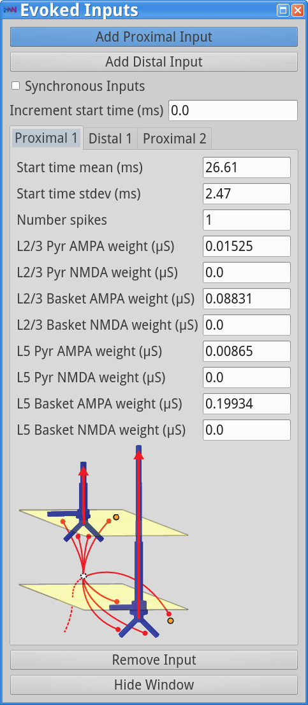</span>

</td>

<td class="c1" colspan="1" rowspan="1">

<span style="overflow: hidden; display: inline-block; margin: 0.00px 0.00px; border: 0.00px solid #000000; transform: rotate(0.00rad) translateZ(0px); -webkit-transform: rotate(0.00rad) translateZ(0px); width: 177.03px; height: 403.53px;">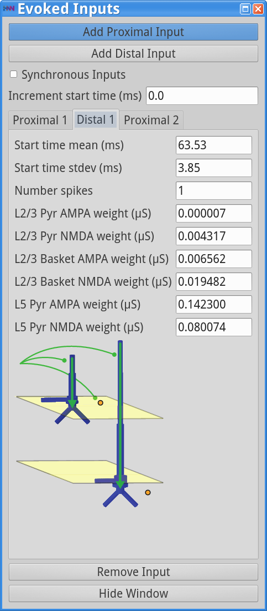</span>

</td>

<td class="c1" colspan="1" rowspan="1">

<span style="overflow: hidden; display: inline-block; margin: 0.00px 0.00px; border: 0.00px solid #000000; transform: rotate(0.00rad) translateZ(0px); -webkit-transform: rotate(0.00rad) translateZ(0px); width: 178.50px; height: 406.89px;"></span>

</td>

</tr>

</tbody>

</table>

<span class="c0"></span>

## <span class="c11">3\. Running the simulation and visualizing net current dipole</span>

<span class="c4">Now that we have an initial parameter set, we can run a series of simulations (100 trials) that</span> <span class="c4">will produce the output shown below. On each simulated trial, the timings of the evoked inputs (i.e., spikes) are chosen from a Gaussian distribution with mean and stdev (standard deviation) as defined in the “Evoked Inputs” dialog boxes. Histograms of each of the evoked inputs will be displayed at the top of the HNN GUI. In the figure below, the thin gray traces are dipole signals from individual trials while the thick black trace is the average ERP, with histograms of the proximal (red, evprox) and distal (green, evdist) driving spikes shown above. Arrows indicate the mean timing of the proximal and distal drive, and the directionality roughly describes the direction of the driven primary dipole currents. This figure also shows MEG data (red; loaded in Step 1) and the root-mean-squared-error comparison between data and model. You can remove the data from the figure by going to to the file menu and choose Clear Data File (</span><span class="c2">File</span><span class="c4">></span> <span class="c2">Clear Data File; or pres Control-C</span><span class="c0">).  </span>

<span class="c0"></span>

<span style="overflow: hidden; display: inline-block; margin: 0.00px 0.00px; border: 0.00px solid #000000; transform: rotate(0.00rad) translateZ(0px); -webkit-transform: rotate(0.00rad) translateZ(0px); width: 482.00px; height: 445.76px;">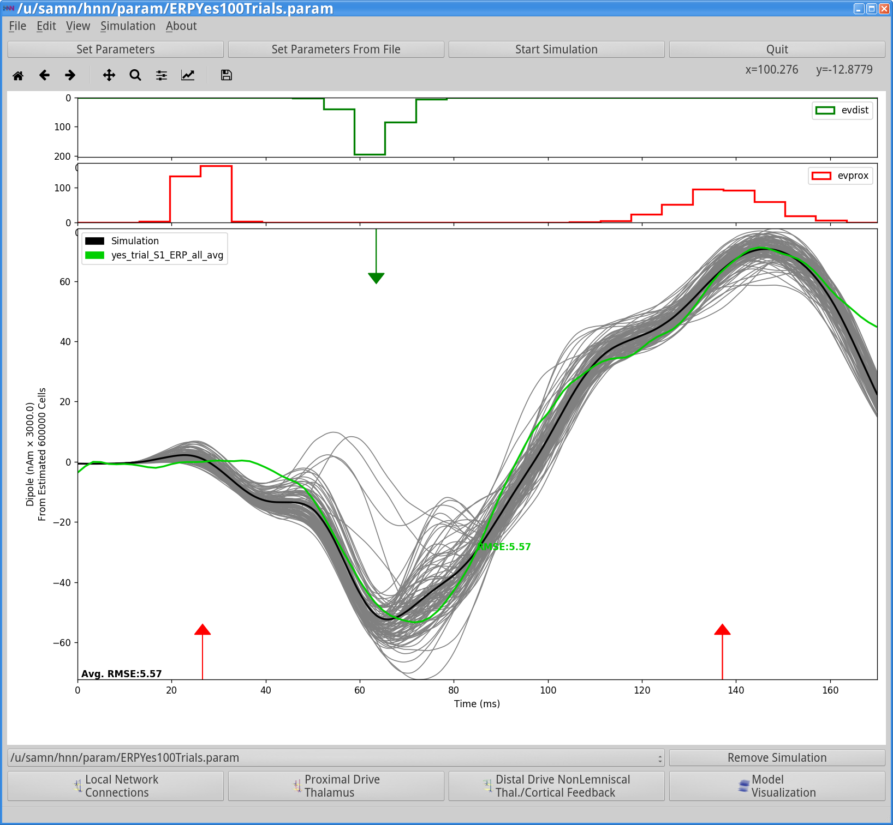</span>

<span class="c0"></span>

<span class="c4">To run this simulation, we’ll first change the simulation name (i.e., the name under which the simulated data will be saved), and reduce the number of trials for a faster simulation. In the “Set Parameters” dialog box, enter a new</span> <span class="c4 c20">descriptive</span><span class="c4">name for the simulation here; for example,</span> <span class="c4 c20">ERPYes2Trials</span><span class="c0">, as shown below.</span>

<span class="c0"></span>

<span style="overflow: hidden; display: inline-block; margin: 0.00px 0.00px; border: 0.00px solid #000000; transform: rotate(0.00rad) translateZ(0px); -webkit-transform: rotate(0.00rad) translateZ(0px); width: 162.67px; height: 190.58px;">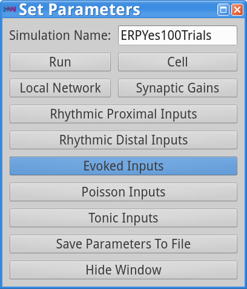</span>

<span class="c0"></span>

<span class="c4">Next, press the</span> <span class="c2">Run</span><span class="c4"> </span><span class="c4">button in the “Set Parameters” dialog box, and a “Run Parameters” dialog box will open, with several adjustable parameters, as shown below. These parameters control the duration, integration time step, number of trials, and number of computer processing cores to run the simulation with.</span> <span class="c4 c20">Note: NumCores is the number of cores to parallelize the model, is automatically detected by HNN and may differ, depending on your hardware</span><span class="c9">.</span> <span class="c0">For a faster simulation, change  the number of trials from 100 to 2\.</span>

<span class="c0"></span>

<span style="overflow: hidden; display: inline-block; margin: 0.00px 0.00px; border: 0.00px solid #000000; transform: rotate(0.00rad) translateZ(0px); -webkit-transform: rotate(0.00rad) translateZ(0px); width: 193.33px; height: 145.69px;">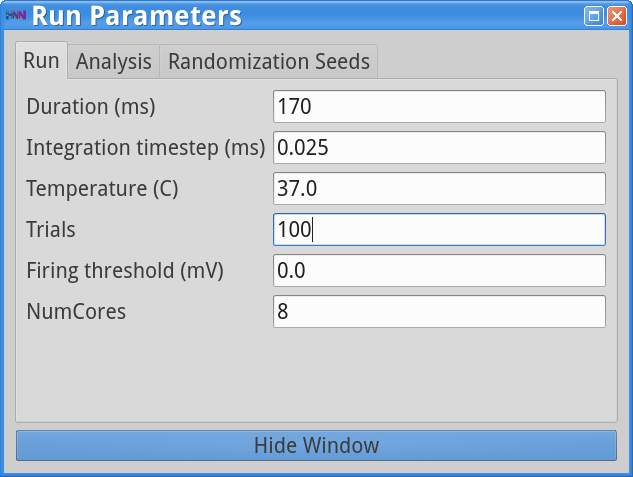</span>

<span class="c9 c18"></span>

<span class="c4">Next, navigate to the main HNN GUI window, shown above, and press the</span> <span class="c2">Run Simulation</span><span class="c0">. This will start the simulation, which should take 1-2 minutes depending on your hardware.</span>

<span class="c0"></span>

<span style="overflow: hidden; display: inline-block; margin: 0.00px 0.00px; border: 0.00px solid #000000; transform: rotate(0.00rad) translateZ(0px); -webkit-transform: rotate(0.00rad) translateZ(0px); width: 486.00px; height: 429.92px;">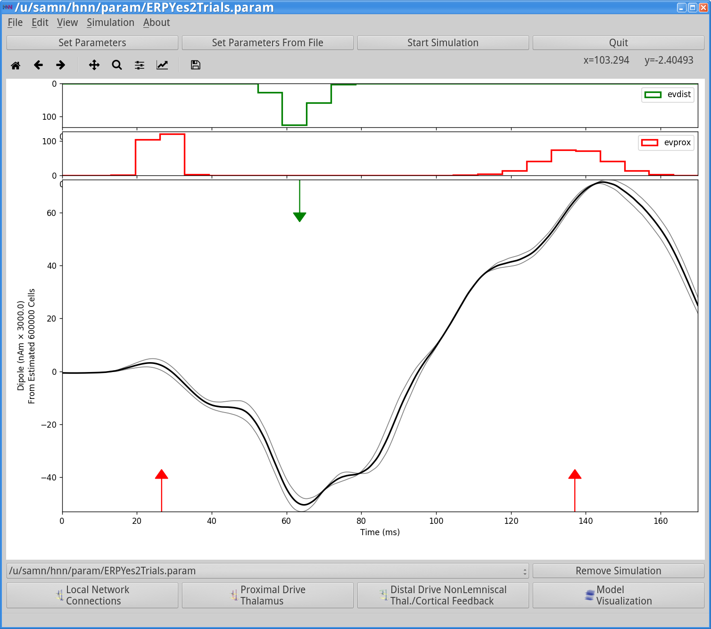</span>

<span class="c0"></span>

<span class="c0">The above figure shows model output in a white window in the HNN GUI after running 2 trials. Here, the experimental data was removed from the window; to do this, navigate to the main GUI and select:</span>

<span class="c2">File</span><span class="c4">></span> <span class="c2">Clear data file</span>

<span class="c0"></span>

<span class="c4">The top two panels of the model output show histograms of input times from distal evoked inputs in green (</span><span class="c4 c20">evdist</span><span class="c4">) and proximal evoked inputs in red (</span><span class="c4 c20">evprox</span><span class="c0">).  The bottom panel shows the simulated dipole signals. The gray traces are from individual trials while the black trace is the average across trials.</span>

<span class="c0"></span>

<span class="c4">Importantly, note that a scaling factor of 3000.00 was multiplied by the net dipole produced by the model, as seen on the y-axis scale. This scaling factor can be adjusted to match the magnitude of the recorded data; the value of 3000 is the default value for the loaded parameter</span><span class="c4">set.</span> <span class="c4">To change this scaling factor, click on the</span> <span class="c2">Run</span><span class="c4">button on the main parameter dialog. Then click on the</span> <span class="c4">“</span><span class="c4">Analysis” tab</span> <span class="c0">and enter the desired scaling factor in the “Dipole Scaling” text box, as shown below.</span>

<span class="c0"></span>

<span style="overflow: hidden; display: inline-block; margin: 0.00px 0.00px; border: 0.00px solid #000000; transform: rotate(0.00rad) translateZ(0px); -webkit-transform: rotate(0.00rad) translateZ(0px); width: 262.50px; height: 197.81px;">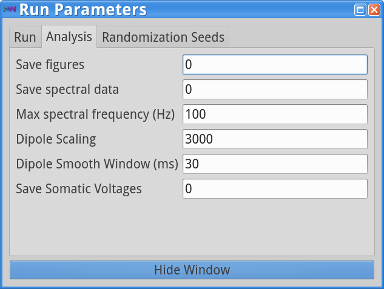</span>

<span class="c0"></span>

<span class="c4">In this case, since the template model contains 200 pyramidal neurons (PNs), the simulation predicts that the number of cells that contribute to the signal is 600,000 (200 x 3000)</span><span class="c4"> PNs.</span>

<span class="c0"></span>

<span class="c4">Also note that in the ERP simulation shown, the raw dipole signal was smoothed using a Hamming filter using a window size of 30 milliseconds, in order to reduce</span> <span class="c4">noise</span> <span class="c0">in the ERP signal generated by this reduced network model. The level of smoothing can be changed through setting the value in the parameters by setting the Dipole Smooth Window (ms) in the Run/Analysis dialog box shown above.</span>

<span class="c4 c26 c20"></span>

<span class="c0">The longer the smoothing window, the more smoothing will occur. To turn off smoothing entirely, set the window size to 0\. Below, we provide an example of the same simulation with smoothing turned off entirely. Note the higher-frequency content compared to the ERP simulation with smoothing turned on.</span>

<span class="c0"></span>

<span class="c0">Also note that before running this simulation, we removed the prior simulation by pressing the “Remove Simulation” button at the bottom of the GUI while it was selected. Had we not done so, both simulation dipoles would be displayed (old simulation with dotted line, new simulation with solid line; see “Tour of the GUI” for more details on simulation control). In the remainder of the tutorial, before running a new simulation, we always remove the previously run simulation.</span>

<span class="c0"></span>

<span style="overflow: hidden; display: inline-block; margin: 0.00px 0.00px; border: 0.00px solid #000000; transform: rotate(0.00rad) translateZ(0px); -webkit-transform: rotate(0.00rad) translateZ(0px); width: 451.29px; height: 399.21px;"></span>

<span class="c0"></span>

## <span class="c11">4\. A closer look inside the simulations: contribution of layers and cell types</span>

<span class="c4">One of the main advantages of simulating neocortical activity is that we can dive into the details of the simulation to investigate the contribution of different components in the network; e.g., layers, cell types,</span> <span class="c4 c20">etc</span><span class="c0">. HNN currently enables the viewing of the following:</span>

<span class="c0">(1) layer specific dipole activity</span>

<span class="c0">(2) spiking activity in each individual neuron population</span>

<span class="c0"></span>

### <span class="c9 c18">Viewing layer specific current dipoles</span>

<span class="c4">F</span><span class="c0">rom the main HNN GUI window, click:</span>

<span class="c2">View</span><span class="c4">></span> <span class="c0 c24">View Simulation Dipoles</span>

<span class="c0"></span>

<span class="c0">This will allow the user to view the dipole signal contributions from individual layers. The following window will appear (first reload the ERPYes2Trials.param simulation, that was run above, into HNN).</span>

<span class="c0"></span>

<span style="overflow: hidden; display: inline-block; margin: 0.00px 0.00px; border: 0.00px solid #000000; transform: rotate(0.00rad) translateZ(0px); -webkit-transform: rotate(0.00rad) translateZ(0px); width: 400.00px; height: 437.55px;">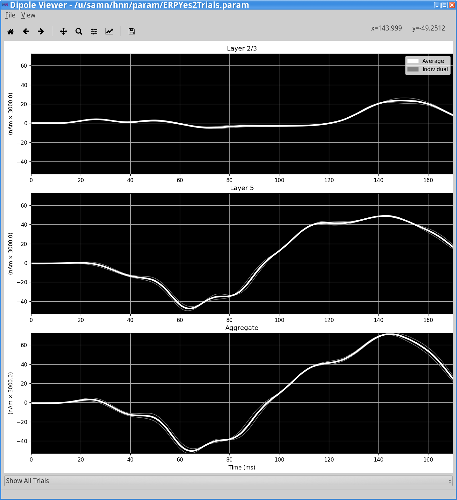</span>

<span class="c0"></span>

<span class="c0">This window shows the dipole contributions from Layer 2/3 (top), Layer 5 (middle), and the aggregate (bottom). Note the different features in Layer 2/3 vs Layer 5 dipole signals, allowing you to tease apart how the different cortical layers contribute to different net waveform features. In this figure, the gray traces are from individual trials (n=2), and the white trace is the average across trials. The same dipole scaling factor is applied (3000.0).</span>

<span class="c0"></span>

<span class="c4">The bottom drop-down menu, which currently has “Show All Trials” selected, allows you to change the view to show the dipole signals from an individual trial. You can also save the image using the standard matplotlib menu at the top (see</span> <span class="c4 c7">[https://matplotlib.org/](https://www.google.com/url?q=https://matplotlib.org/&sa=D&ust=1552418807697000)</span><span class="c0"> for more information).</span>

<span class="c0"></span>

### <span class="c9 c18">Viewing network spiking activity</span>

<span class="c0">To view the spiking activity generated by different neuronal populations in the network, navigate to the main GUI window and select:</span>

<span class="c2">View</span><span class="c4">></span> <span class="c0 c24">View Simulation Spiking Activity</span>

<span class="c0"></span>

<span class="c0">The following window will appear.</span>

<span class="c0"></span>

<span style="overflow: hidden; display: inline-block; margin: 0.00px 0.00px; border: 0.00px solid #000000; transform: rotate(0.00rad) translateZ(0px); -webkit-transform: rotate(0.00rad) translateZ(0px); width: 453.66px; height: 477.09px;">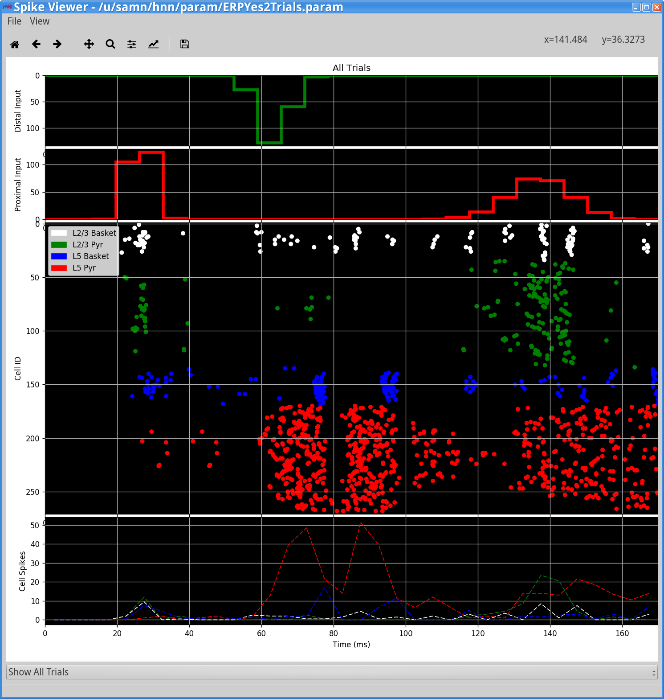</span>

<span class="c0"></span>

<span class="c4">This window shows the spiking activity produced in each population in response to the evoked inputs. The top two panels show histograms of distal evoked inputs (green) and proximal evoked inputs (red) provided to the neurons. The large third panel shows a raster plot of the spiking activity generated by the individual neurons, with different populations in different colors as labeled  (x-axis: time in ms; y-axis: neuron identifier). The neuron identifiers are arranged vertically by layer, with top representing supragranular layers and the bottom representing the infragranular layers. Individual neuron types are drawn in the different colors shown in the legend. The dotted lines in the bottom panel show a time-series of summed activity per population (these use the same color code as the individual spikes; you can turn these lines off or on by selecting</span> <span class="c2">View</span><span class="c4">></span> <span class="c2">Toggle Histograms</span><span class="c0">). The initial view shows the aggregate spiking activity across trials. To see spiking activity generated by a single trial, select the trial number using the combination box at the bottom of the window. This spike viewer window also provides the standard save/navigation functionality through the matplotlib control at the top.</span>

<span class="c0"></span>

### <span class="c9 c18">Viewing ERP Spectrograms</span>

<span class="c4">HNN allows you to generate a time-frequency representation of ERP dipole signals. In order to do so, access the</span> <span class="c4">Run</span><span class="c4">parameters by selecting</span> <span class="c2">Run</span><span class="c4"> and clicking on the “</span><span class="c4">Analysis”</span><span class="c4">tab. Then set the</span> <span class="c4 c20">Save spectral data</span><span class="c0"> value to 1\.</span>

<span class="c0"></span>

<span class="c4">Running an ERP simulation will now display the wavelet time-frequency representation of the ERP dipole signal as shown in the figure below. Note that when running multiple trials, the average of individual wavelet transforms is shown, rather than performing the wavelet transform on the average dipole signal.</span> <span class="c4">Also note that in the simulation below, the evoked inputs were shifted forward 50 ms in time, because the wavelet analysis cuts off the first 50 ms of the dipole signal to avoid edge artifacts.</span><span class="c0"> Finally, note that the previous simulation was removed before running this new simulation.</span>

<span class="c0"></span>

<span style="overflow: hidden; display: inline-block; margin: 0.00px 0.00px; border: 0.00px solid #000000; transform: rotate(0.00rad) translateZ(0px); -webkit-transform: rotate(0.00rad) translateZ(0px); width: 430.50px; height: 380.83px;">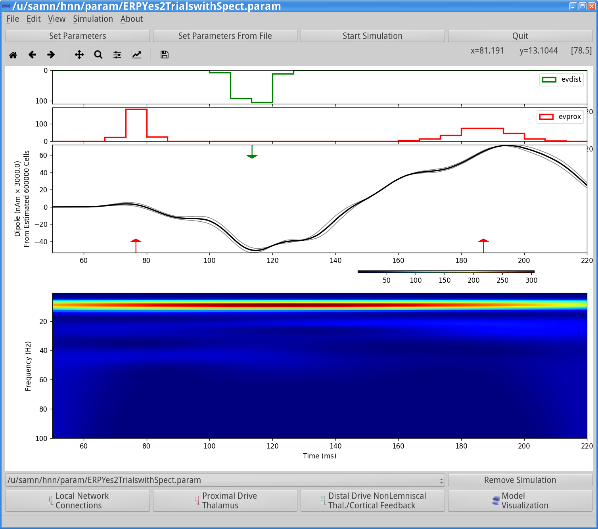</span>

<span class="c0"></span>

## <span class="c9 c18">5\. Comparing model output and recorded data</span>

<span class="c4">When data are loaded into HNN and a simulation is run, the software automatically calculates and plots root-mean-squared-error (RMSE) between the average simulation ERP waveform and the waveform loaded. An example of this is shown in the figure below for the two trial simulation described in Step 4\. To create this figure, follow Step 1 to load the yes_trial_S1_ERP_all_avg.txt data file (</span><span class="c2">File</span><span class="c4">></span> <span class="c2">Load data file</span><span class="c4">and select data/MEG_detection_data/yes_trial_S1_ERP_all_avg.txt). HNN will load the data and display the waveform in the dipole window as shown with a</span> <span class="c4">blue</span><span class="c0"> dotted line below. (Note, when loading your own data, if it was not collected at 600 Hz, you must first downsample to 600 Hz to view it in the HNN GUI).</span>

<span class="c0"></span>

<span style="overflow: hidden; display: inline-block; margin: 0.00px 0.00px; border: 0.00px solid #000000; transform: rotate(0.00rad) translateZ(0px); -webkit-transform: rotate(0.00rad) translateZ(0px); width: 460.76px; height: 407.59px;">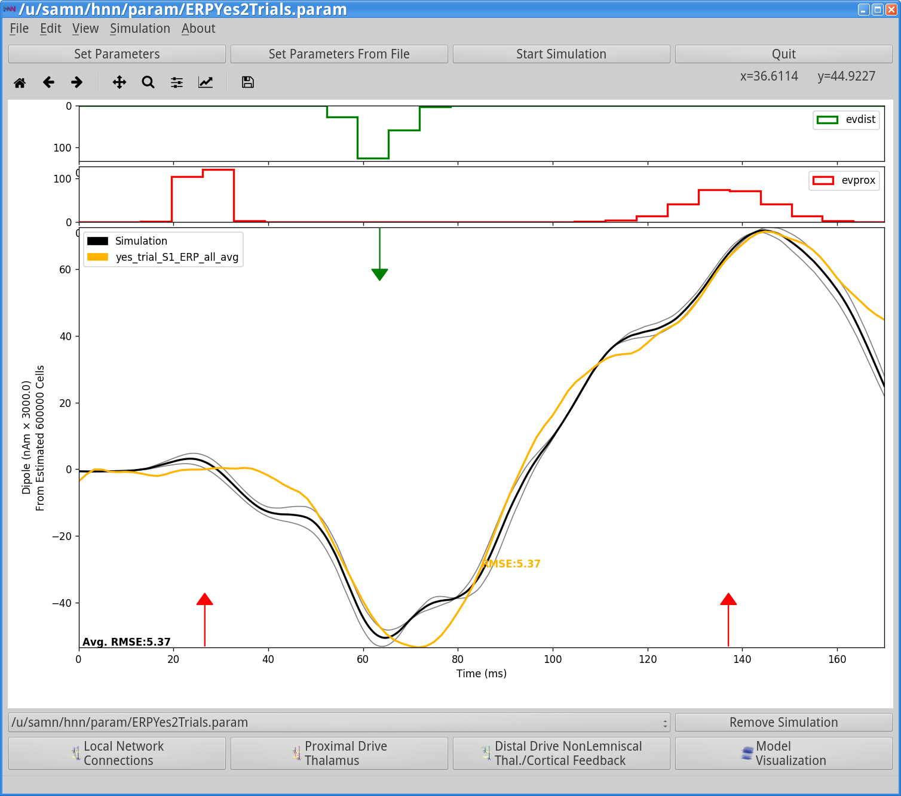</span>

<span class="c0"></span>

<span class="c4">HNN will also calculate the root-mean-squared-error (RMSE) between the average simulation simulated ERP waveform (black trace, n=2 trials ) and the waveform loaded from the .txt file. As seen in the figure, the RMSE=5.37 in this case. Notice that when we simulated more trials (n=100), as shown in the figure</span> <span class="c4">in Step</span> <span class="c4">3, the RMSE between the data and the simulated average ERP was slightly higher (RMSE=5.57).</span> <span class="c4">Depending on the number of trials you run, and adjustments to the parameter values, you may be able to reduce the RMSE.</span>

<span class="c0"></span>

## <span class="c9 c18">6\. Adjusting parameters</span>

<span class="c4">Parameter a</span><span class="c4">djustments will be key to developing and testing hypotheses on the circuit origin of your own ERP data. HNN is designed so that many of parameters in the model can be adjusted from the GUI</span> <span class="c4">(see Tour of the GUI)</span><span class="c0">. Here, we’ll walk through examples of how to adjust several “Evoked Input” parameters to investigate how they impact the evoked response.</span>

<span class="c0"></span>

### <span class="c9">6.1 Changing the synchrony of the evoked inputs</span>

<span class="c4">In the example evoked response simulation described in Step 3, the time that each exogenous driving spike was provided to each cell in the local network was chosen independently from a Gaussian distribution, for both the proximal and distal inputs; this variability in timing created variability in the response of each cell in the network. Asynchronous exogenous drive is the default configuration in HNN. HNN also provides the capability to provide exogenous driving inputs to all cells in the network synchronously (0ms lag); t</span><span class="c0">his will reduce variability in timing of evoked inputs, producing a stronger response, and may or may not provide a better fit to the data.  </span>

<span class="c0"></span>

<span class="c4">To change the evoked inputs to contact the cells in network synchronously, first change the simulation name to,</span> <span class="c4 c20">e.g.,</span><span class="c4">ERPYes2TrialsSync in the main</span> <span class="c2">Set Parameters</span><span class="c0"> window. This will save the simulation data to a file with this new name. If you don’t still have the “Evoked Inputs” dialog window open, click:</span>

<span class="c4">        </span><span class="c2">Set Parameters</span><span class="c4">></span> <span class="c0 c24">Evoked Inputs</span>

<span class="c0"></span>

<span class="c4">Click the “</span><span class="c4">Synchronous Inputs”</span><span class="c4">checkbox, then press the</span> <span class="c2">Start Simulation</span><span class="c0"> button in the main HNN GUI.</span>

<span class="c0"></span>

<span style="overflow: hidden; display: inline-block; margin: 0.00px 0.00px; border: 0.00px solid #000000; transform: rotate(0.00rad) translateZ(0px); -webkit-transform: rotate(0.00rad) translateZ(0px); width: 180.53px; height: 411.51px;"></span>

<span class="c0"></span>

<span class="c0">After the simulation has completed, you’ll see the following output. Although the model replicates some gross features of the experimental data, the fit to the data is now substantially worse (RMSE=16.25). Notice also that there is significantly lower variability of the input times in the green/red histograms at the top of the figure (compare to evoked response inputs shown in Step 5), predicting (in this case) the evoked responses are more likely to be non-synchronous. Remember, however, that this simulation is only based on two trials.</span>

<span class="c0"></span>

<span style="overflow: hidden; display: inline-block; margin: 0.00px 0.00px; border: 0.00px solid #000000; transform: rotate(0.00rad) translateZ(0px); -webkit-transform: rotate(0.00rad) translateZ(0px); width: 475.75px; height: 420.86px;"></span>

<span class="c0"></span>

<span class="c0">If you’re adventurous and have some time, try running the same parameters with 100 trials. Doing so will reduce the RMSE as shown in the image below (RMSE=13.92). Notice also the change in the histograms of driving spikes.</span>

<span class="c0"></span>

<span style="overflow: hidden; display: inline-block; margin: 0.00px 0.00px; border: 0.00px solid #000000; transform: rotate(0.00rad) translateZ(0px); -webkit-transform: rotate(0.00rad) translateZ(0px); width: 480.00px; height: 424.62px;"></span>

<span class="c0"></span>

### <span class="c9 c18">6.1.1 Exercises for further exploration</span>

*   <span class="c0">Try adjusting the duration and strength of the distal drive; how does this affect the simulation?</span>
*   <span class="c0">View the evoked responses for different values of the scaling parameter set with “Dipole Scaling” in the Run/Analysis dialog box; how does this affect the simulation?</span>
*   <span class="c0">View the evoked responses for different values of the smoothing parameter set with Dipole Smooth Window (ms) in the Run/Analysis dialog box; how does this affect the simulation?</span>

### <span class="c9 c18"></span>

### <span class="c9">6.2 Changing the timing and strength (post-synaptic conductance) of the evoked inputs</span>

<span class="c4">For this part of the tutorial, we’ll load a different experimental data set into the GUI, at first keeping the simulated data from step 6.1\. The new experimental data represents the evoked response from</span> <span class="c4 c20">non-detected</span><span class="c4"> threshold level stimuli in the experiment described in the “Getting Started” section above</span><span class="c4 c25">[1](https://www.google.com/url?q=https://paperpile.com/c/2dja22/RnG2&sa=D&ust=1552418807707000)</span><span class="c0">.</span>

<span class="c0"></span>

<span class="c4">First, let’s clear the MEG data from the</span> <span class="c4 c20">detected</span><span class="c4">threshold level stimuli. To do this, click</span> <span class="c2">File</span><span class="c4">></span> <span class="c2">Clear data file</span><span class="c0"> from the main GUI window (or press Control-C).</span>

<span class="c0"></span>

<span class="c4">Next, load the data from the</span> <span class="c4 c20">non-detected</span><span class="c4">trials. Go to</span> <span class="c2">File</span><span class="c4">></span> <span class="c2">Load data file</span><span class="c4"> (or press Control-D) and select data/MEG_detection_data/</span><span class="c4">no_trial_S1_ERP_all_avg</span><span class="c0">.txt. Notice that the timing and magnitude of the peaks in this new data set (the purple dashed curve in the below figure) are different than for the evoked responses that were detected (shown in red curve in Step 6.1).</span>

<span class="c0"></span>

<span class="c0">HNN will automatically recalculate the model fit to the data (i.e, the RMSE between the average model response and the loaded data) based on the prior simulations (Step 6.1), showing that the previously used parameter set gave a poor fit to the new data (RMSE=22.73).</span>

<span class="c0"></span>

<span style="overflow: hidden; display: inline-block; margin: 0.00px 0.00px; border: 0.00px solid #000000; transform: rotate(0.00rad) translateZ(0px); -webkit-transform: rotate(0.00rad) translateZ(0px); width: 468.83px; height: 414.73px;"></span>

<span class="c0"></span>

<span class="c0">In this case, the magnitudes of the peaks in the model are larger than the data, and the timing of the peaks is faster.</span>

<span class="c0"></span>

<span class="c4 c20">Hypothesis testing</span><span class="c4">:</span> <span class="c4">Logical</span><span class="c9"> </span><span class="c4">hypotheses to test</span><span class="c0"> to account for these differences would be (1) a decrease in the strength of the inputs that create the evoked response, and (2) delaying the arrival time of these inputs to the network. The former hypothesis is likely to decrease the magnitude of the peaks, and the latter to delay their timing, hence creating a better fit to the data.</span>

<span class="c0"></span>

<span class="c4">To test these hypotheses, we’ll adjust the parameters as described. For simplicity, we have created a param file, which can be loaded into the GUI, that accounts for such changes and accurately reproduces the new data. Load the</span> <span class="c4">ERPNo100Trials.param</span><span class="c4">file values by clicking</span> <span class="c2">Set Parameters From File</span><span class="c4"> and selecting the file from HNN’s param subfolder or your local machine. To view the new parameters, click:</span>

<span class="c2">Set Parameters</span><span class="c4">></span> <span class="c0 c24">Evoked Inputs</span>

<span class="c0"></span>

<span class="c0">You should see the new values, as displayed in the dialog boxes below.</span>

<span class="c0"></span>

<a id="t.4ddb8f843d82ffd23098bf8aea89b4b1c103b929"></a><a id="t.2"></a>

<table class="c22">

<tbody>

<tr class="c17">

<td class="c33" colspan="1" rowspan="1">

<span style="overflow: hidden; display: inline-block; margin: 0.00px 0.00px; border: 0.00px solid #000000; transform: rotate(0.00rad) translateZ(0px); -webkit-transform: rotate(0.00rad) translateZ(0px); width: 180.09px; height: 410.51px;"></span>

</td>

<td class="c33" colspan="1" rowspan="1">

<span style="overflow: hidden; display: inline-block; margin: 0.00px 0.00px; border: 0.00px solid #000000; transform: rotate(0.00rad) translateZ(0px); -webkit-transform: rotate(0.00rad) translateZ(0px); width: 180.53px; height: 411.51px;">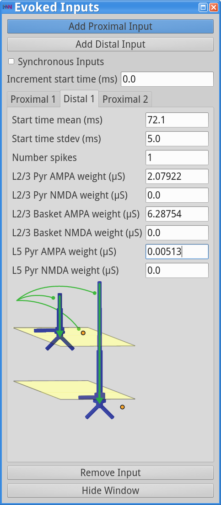</span>

</td>

<td class="c33" colspan="1" rowspan="1">

<span style="overflow: hidden; display: inline-block; margin: 0.00px 0.00px; border: 0.00px solid #000000; transform: rotate(0.00rad) translateZ(0px); -webkit-transform: rotate(0.00rad) translateZ(0px); width: 180.53px; height: 411.51px;">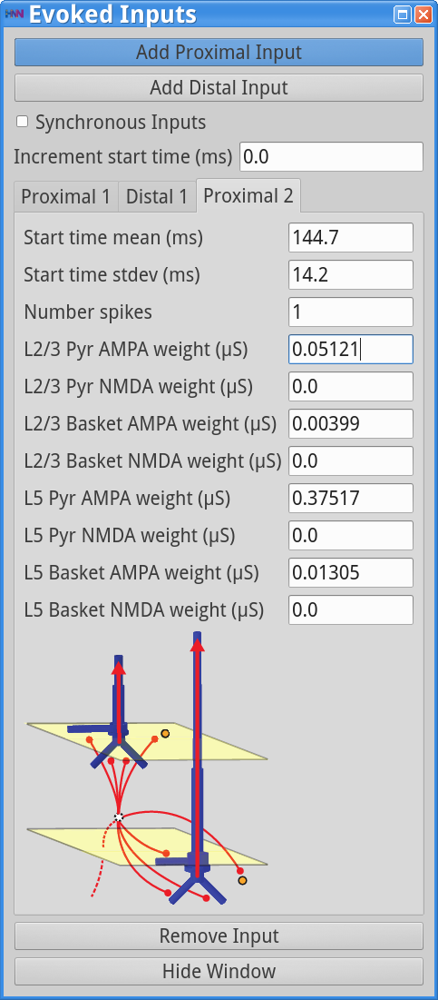</span>

</td>

</tr>

</tbody>

</table>

<span class="c0"></span>

<span class="c4">Notice that the weights (post-synaptic conductances) of the evoked inputs to pyramidal neurons, relative to interneurons in a given layer, are generally smaller than they were in the simulations in Step 6.1 and in prior steps. Also, the mean input times are greater for all inputs, and the variances has increased for the Proximal 2 input.</span>

<span class="c0"></span>

<span class="c4">To run the simulation, let’s reduce the number of trials to 2 (in the “Run” dialog box, see Step 4 above) for speed, change the simulation name (in the “Set Parameters” dialog box), and see how well the data fits after running the simulation (with the</span> <span class="c2">Start Simulation</span><span class="c0"> button on the main GUI).</span>

<span class="c0"></span>

<span class="c0">Simulation results after running 2 trials in the model with the new parameters (non-detection parameters) are shown in the figure below.</span>

<span class="c0"></span>

<span style="overflow: hidden; display: inline-block; margin: 0.00px 0.00px; border: 0.00px solid #000000; transform: rotate(0.00rad) translateZ(0px); -webkit-transform: rotate(0.00rad) translateZ(0px); width: 465.37px; height: 411.67px;">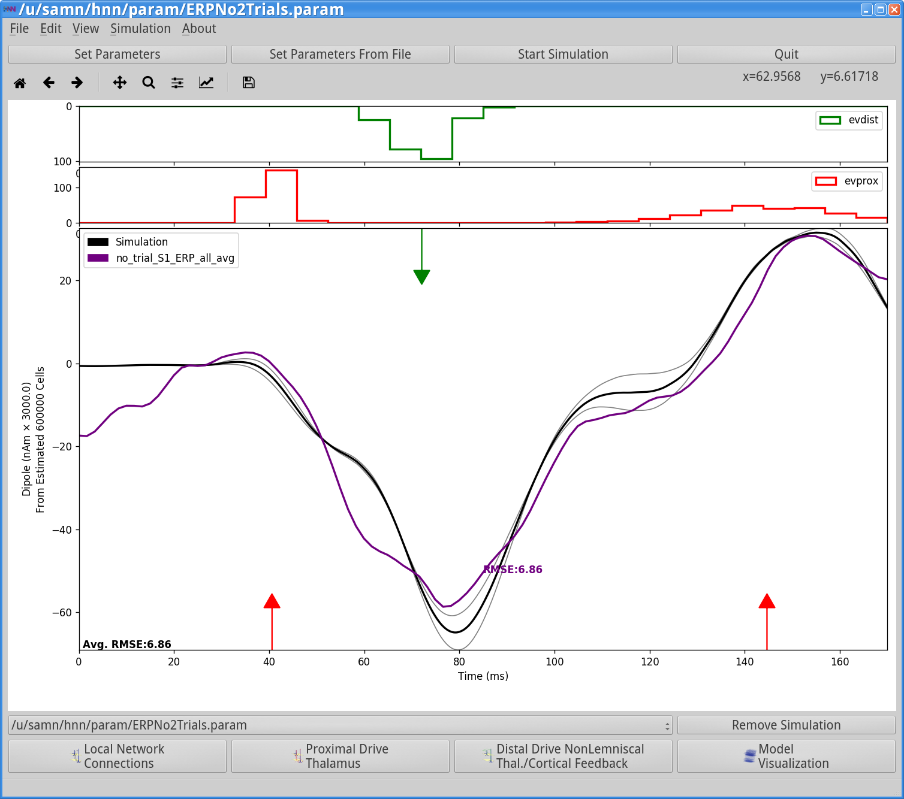</span>

<span class="c0"></span>

<span class="c0">For this new parameter set, there is now a better fit to the experimental data (RMSE=6.86). One interpretation of these results is that on non-detected trials (data are in Step 6.2), the feedback (distal 1) and late-feedforward (proximal 2) inputs to the network are more delayed, less synchronous, and overall weaker than on detected trials (see Step 6.1 and above).</span>

<span class="c0"></span>

### <span class="c18 c42">6.2.1 Simulating the Suprathreshold response</span>

<span class="c0"></span>

<span class="c4">For this part of the tutorial, we’ll load a different experimental data set into the GUI, at first keeping the simulated data from step 6.1\. The new experimental data represents the evoked response from</span> <span class="c4 c20">suprathreshold</span> <span class="c4">level</span> <span class="c4">stimuli in the experiment described in the “Getting Started” section above</span><span class="c4 c38">[1](https://www.google.com/url?q=https://paperpile.com/c/2dja22/RnG2&sa=D&ust=1552418807715000)</span><span class="c0">.</span>

<span class="c0"></span>

<span class="c4">First, let’s clear any MEG and simulation data currently loaded. To do this, click</span> <span class="c2">Edit</span><span class="c4">></span> <span class="c2">Clear canvas</span><span class="c0"> from the main GUI window (or press Control-X).</span>

<span class="c0"></span>

<span class="c4">Now, load the data from the</span> <span class="c4 c20">threshold-level detected</span><span class="c4">trials. Go to</span> <span class="c2">File</span><span class="c4">></span> <span class="c2">Load data file</span><span class="c4"> (or press Control-D) and select data/MEG_detection_data/yes</span><span class="c4">_trial_S1_ERP_all_avg</span><span class="c4">.txt. Next, load the data from the new supra</span><span class="c4 c20">threshold-level detected</span><span class="c4">trials. Go to</span> <span class="c2">File</span><span class="c4">></span> <span class="c2">Load data file</span><span class="c4"> (or press Control-D) and select data/MEG_detection_data/</span><span class="c4 c20">S1_SupraT.txt</span><span class="c0">. Notice that the two waveforms displayed have substantially different features, including altered timing, amplitude, and sharpness of the peaks in this new data set.</span>

<span class="c0"></span>

<span style="overflow: hidden; display: inline-block; margin: 0.00px 0.00px; border: 0.00px solid #000000; transform: rotate(0.00rad) translateZ(0px); -webkit-transform: rotate(0.00rad) translateZ(0px); width: 410.90px; height: 361.62px;">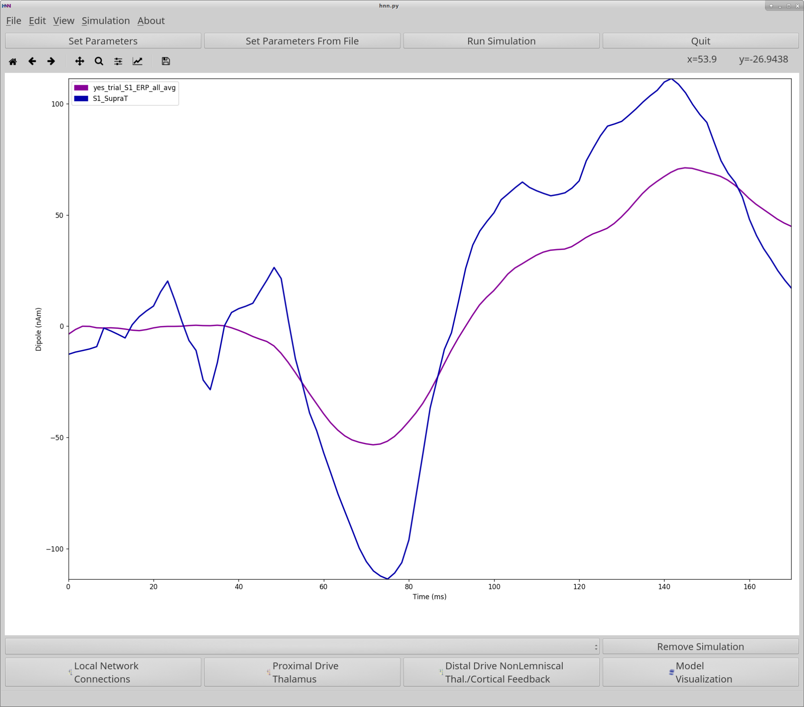</span>

<span class="c0"></span>

<span class="c4">Next, load the threshold-level parameters into HNN. At the top of the HNN GUI, click</span> <span class="c2">Set Parameters From File</span><span class="c0"> and select the file default.param from HNN’s param subfolder from your local machine.</span>

<span class="c0"></span>

<span style="overflow: hidden; display: inline-block; margin: 0.00px 0.00px; border: 0.00px solid #000000; transform: rotate(0.00rad) translateZ(0px); -webkit-transform: rotate(0.00rad) translateZ(0px); width: 421.60px; height: 370.50px;"></span>

<span class="c0"></span>

<span class="c0">HNN will automatically calculate the model fit to both datasets loaded (i.e, the RMSE between the average model response and the loaded data) based on the default simulation, showing that the threshold level parameter set (default.param) gives a poor fit to the new data (Dark blue trace with RMSE=33.01).</span>

<span class="c0"></span>

<span class="c4 c20">Hypothesis testing</span><span class="c4">: Logical</span><span class="c9"> </span><span class="c0">hypotheses to test to account for these differences would be (1) an increase in the strength of the inputs that create the evoked response, and (2) reducing the delay in the arrival time of the inputs to the network. The former hypothesis is likely to increase the magnitude of the peaks, and the latter to cause them to occur earlier, creating a better fit to the data.</span>

<span class="c0"></span>

<span class="c4">To test these hypotheses, we’ll adjust the parameters as described. For simplicity, we have created a param file, which can be loaded into the GUI, that accounts for such changes and accurately reproduces the new data. Load the ERPYesSupraT.param file values by clicking</span> <span class="c2">Set Parameters From File</span><span class="c4"> and selecting the file from HNN’s param subfolder on your local machine. To view the new parameters, click:</span>

<span class="c2">Set Parameters</span><span class="c4">></span> <span class="c0 c24">Evoked Inputs</span>

<span class="c0"></span>

<span class="c4">You should see the new values, as displayed in the dialog boxes below.</span>

<span class="c0"></span>

<a id="t.4ddb8f843d82ffd23098bf8aea89b4b1c103b929"></a><a id="t.3"></a>

<table class="c39">

<tbody>

<tr class="c23">

<td class="c16" colspan="1" rowspan="1">

<span style="overflow: hidden; display: inline-block; margin: 0.00px 0.00px; border: 0.00px solid #000000; transform: rotate(0.00rad) translateZ(0px); -webkit-transform: rotate(0.00rad) translateZ(0px); width: 208.77px; height: 406.10px;"></span>

</td>

<td class="c16" colspan="1" rowspan="1">

<span style="overflow: hidden; display: inline-block; margin: 0.00px 0.00px; border: 0.00px solid #000000; transform: rotate(0.00rad) translateZ(0px); -webkit-transform: rotate(0.00rad) translateZ(0px); width: 209.74px; height: 408.00px;">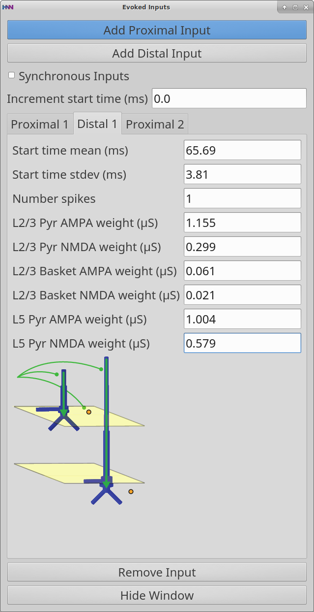</span>

</td>

<td class="c16" colspan="1" rowspan="1">

<span style="overflow: hidden; display: inline-block; margin: 0.00px 0.00px; border: 0.00px solid #000000; transform: rotate(0.00rad) translateZ(0px); -webkit-transform: rotate(0.00rad) translateZ(0px); width: 212.24px; height: 412.85px;">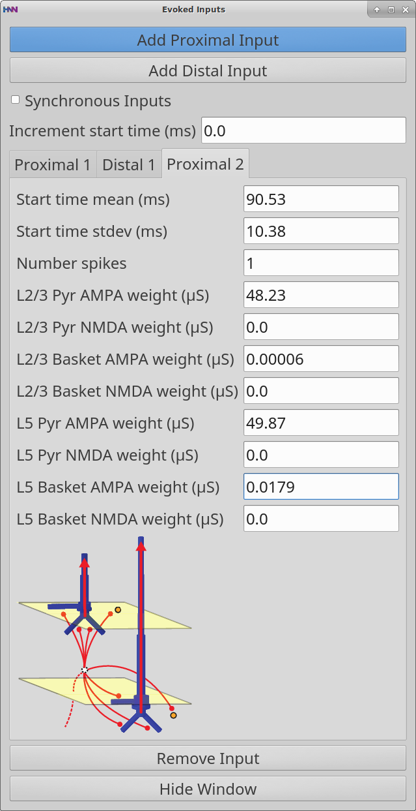</span>

</td>

</tr>

</tbody>

</table>

<span class="c0"></span>

<span class="c4">Next, let’s run the simulation with the</span> <span class="c2">Start Simulation</span><span class="c0"> button on the main GUI.</span>

<span class="c0"></span>

<span class="c0">Simulation results after running the model with the new parameters (supra-threshold detection parameters) are shown in the figure below.</span>

<span class="c0"></span>

<span style="overflow: hidden; display: inline-block; margin: 0.00px 0.00px; border: 0.00px solid #000000; transform: rotate(0.00rad) translateZ(0px); -webkit-transform: rotate(0.00rad) translateZ(0px); width: 507.70px; height: 446.70px;">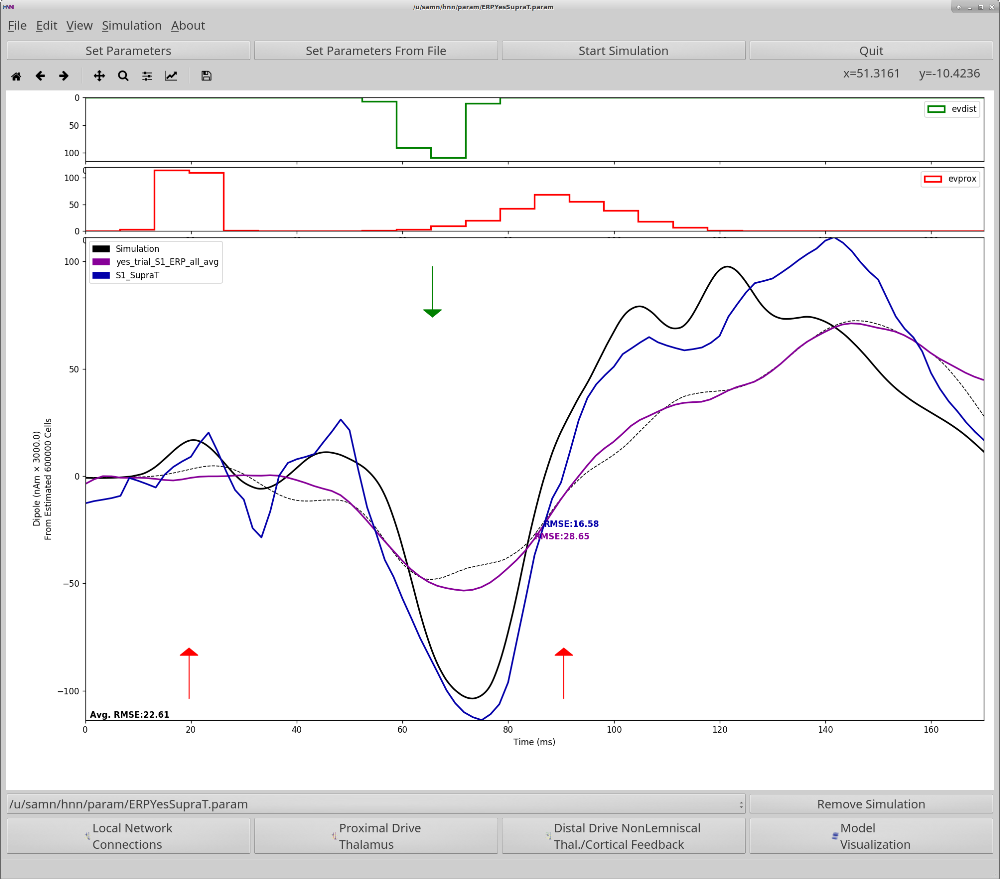</span>

<span class="c0"></span>

<span class="c0">Let’s take a look at the output. First, note that the previous threshold-level simulation was not removed (dipole drawn with dotted black line), to allow comparison to the new supra-threshold simulation (dipole drawn with solid black line). For the new suprathreshold detection parameter set, there is now a better fit to the experimental data (RMSE=16.58), with all major waveform features in the experiment and simulation in agreement. One interpretation of these results is that on supra-threshold detected trials, both the feedforward and feedback inputs stronger and both early and late feedforward inputs arrive substantially earlier. Overall stronger inputs, then promotes tactile detection.</span>

<span class="c0"></span>

### <span class="c9 c18">6.2.2 Exercises for further exploration</span>

*   <span class="c0">Run 5 trials to see if the RMSE in the examples above is reduced. Can you adjust the parameters to reduce the RMSE?</span>
*   <span class="c0">Try running the simulation for longer and adding an additional proximal or distal drive; how does this affect the simulation?</span>

<span class="c0"></span>

## <span class="c11">7</span><span class="c9 c18">. Have fun exploring your own data!</span>

<span class="c0">Follow steps 1-6 above using your data and parameter adjustments based on your own hypotheses.  </span>

<span class="c0"></span>

<span class="c9 c18">References</span>

<span class="c4 c28">1.        </span><span class="c4 c27">[Jones, S. R., Pritchett, D. L., Stufflebeam, S. M., Hämäläinen, M. & Moore, C. I. Neural correlates of tactile detection: a combined magnetoencephalography and biophysically based computational modeling study.](https://www.google.com/url?q=http://paperpile.com/b/2dja22/RnG2&sa=D&ust=1552418807723000) </span><span class="c4 c20 c30">[J. Neurosci.](https://www.google.com/url?q=http://paperpile.com/b/2dja22/RnG2&sa=D&ust=1552418807723000)</span><span class="c4 c27">[ ](https://www.google.com/url?q=http://paperpile.com/b/2dja22/RnG2&sa=D&ust=1552418807724000)</span><span class="c9 c27">[27,](https://www.google.com/url?q=http://paperpile.com/b/2dja22/RnG2&sa=D&ust=1552418807724000)</span><span class="c4 c27">[ 10751–10764 (2007).](https://www.google.com/url?q=http://paperpile.com/b/2dja22/RnG2&sa=D&ust=1552418807724000)</span>

<span class="c4 c28">2.        </span><span class="c4 c27">[Cauller, L. J. & Kulics, A. T. The neural basis of the behaviorally relevant N1 component of the somatosensory-evoked potential in SI cortex of awake monkeys: evidence that backward cortical projections signal conscious touch sensation.](https://www.google.com/url?q=http://paperpile.com/b/2dja22/IAm7&sa=D&ust=1552418807725000) </span><span class="c4 c20 c30">[Exp. Brain Res.](https://www.google.com/url?q=http://paperpile.com/b/2dja22/IAm7&sa=D&ust=1552418807725000)</span><span class="c4 c27">[ ](https://www.google.com/url?q=http://paperpile.com/b/2dja22/IAm7&sa=D&ust=1552418807725000)</span><span class="c9 c27">[84,](https://www.google.com/url?q=http://paperpile.com/b/2dja22/IAm7&sa=D&ust=1552418807725000)</span><span class="c4 c27">[ 607–619 (1991).](https://www.google.com/url?q=http://paperpile.com/b/2dja22/IAm7&sa=D&ust=1552418807726000)</span>

<span class="c0">At the top of the HNN GUI, click Set Parameters From File and select the file ERPYes100Trials.param from HNN’s param subfolder or from your local machine.</span>


```python

```
