<div>

<span class="c20"></span>

</div>

# <span class="c11">Tour of the Graphical User Interface (GUI)</span>

<span class="c0"></span>

<span class="c0">Here we provide an overview of the major GUI components, and provide a description of all the parameters that the GUI provides.</span>

<span class="c0"></span>

<span class="c0">This is a display of the GUI after running a simulation that produces an event-related potential (ERP; see ERP tutorial for more information on that simulation’s details).</span>

<span class="c0"></span>

<span style="overflow: hidden; display: inline-block; margin: 0.00px 0.00px; border: 0.00px solid #000000; transform: rotate(0.00rad) translateZ(0px); -webkit-transform: rotate(0.00rad) translateZ(0px); width: 392.00px; height: 346.77px;">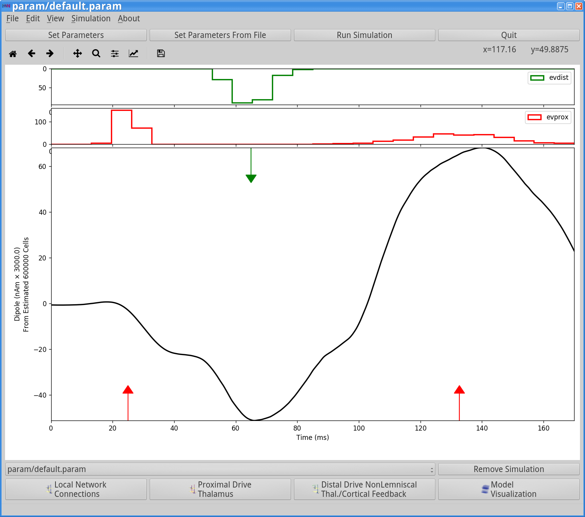</span>

<span class="c0"></span>

<span class="c0">The top of the GUI contains a standard menu and buttons for setting parameters, running simulations, and viewing the simulation/experimental data output.</span>

<span class="c0"></span>

<span class="c0">The bottom of the main GUI window shows a list of the simulations that have been run. As you run more simulations, the average dipole signal from each simulation gets overlaid in the plot, as shown below.</span>

<span class="c0"></span>

<span style="overflow: hidden; display: inline-block; margin: 0.00px 0.00px; border: 0.00px solid #000000; transform: rotate(0.00rad) translateZ(0px); -webkit-transform: rotate(0.00rad) translateZ(0px); width: 378.47px; height: 334.50px;"></span>

<span class="c0"></span>

<span class="c0">In the example above, the newest simulation’s dipole is drawn in a solid line, while previously run simulations are drawn using dotted lines. You can select/highlight a particular simulation by clicking on the different simulations populating the list, or from menu Simulation -> Go to Previous Simulation (Ctrl+Z), Go to Next Simulation (Ctrl+Y). Cycling between simulations is useful for comparing how different model parameters influence the generated dipole signal.</span>

<span class="c0"></span>

<span class="c0">You can also remove the currently selected simulation from view by clicking the “Remove Simulation” button, if that particular simulation is no longer of interest. To remove all simulations from display, click on the Simulation menu -> Clear simulation(s). This is useful if you change the MEG/EEG pattern you are modeling (e.g. event related potential vs. ongoing rhythmic activity).</span>

<span class="c0"></span>

<span class="c0">In the window shown below, there are several schematics to provide intuition on the model’s structure, and to provide quick access to the model parameters. To access the model parameters from that window, click on any of the buttons. Below, we describe all the model parameters in detail.</span>

<span class="c0"></span>

<span style="overflow: hidden; display: inline-block; margin: 0.00px 0.00px; border: 0.00px solid #000000; transform: rotate(0.00rad) translateZ(0px); -webkit-transform: rotate(0.00rad) translateZ(0px); width: 492.50px; height: 176.37px;">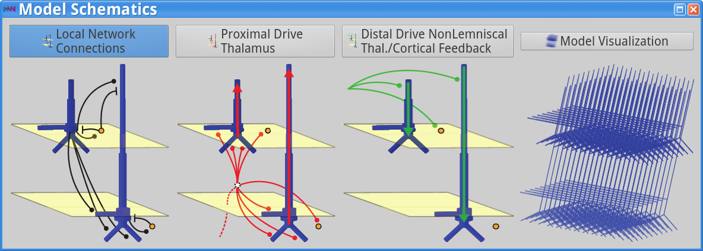</span>

<span class="c0"></span>

## <span class="c11">Preliminaries: Parameter Files</span>

<span class="c0">Before delving into the details of the GUI, we first provide an overview of the parameter files used by HNN. Parameter files are text-based and contain all the key parameters needed to run a model. These parameters include synaptic inputs, neuronal biophysics, and local network connectivity. HNN reads/writes these parameter files so you don’t have to edit them yourself.</span>

<span class="c0"></span>

<span class="c0">In order to facilitate effective modeling, we have provided a set of text-based parameter files that allow you to replicate event related potentials (ERPs), and alpha/beta/gamma rhythms. HNN can load the parameter files, allowing you to replicate the dynamics, see the critical parameter values that are responsible for the observed dynamics, and then modify the parameter files/values to observe the effect on dynamics. Parameter files are stored in the param subdirectory and can be viewed in any text editor. To load these parameter files into HNN, press the Set Parameters from File button, select the parameter file, and press enter. HNN will parse the file and display the values in the GUI. Then, running the simulation will use these parameter values.</span>

<span class="c0"></span>

## <span class="c11">Setting Parameters</span>

<span class="c0">To view and set the parameters that control the simulation, press the Set Parameters button from the main GUI window. This will bring up the following dialog:</span>

<span class="c0"></span>

<span style="overflow: hidden; display: inline-block; margin: 0.00px 0.00px; border: 0.00px solid #000000; transform: rotate(0.00rad) translateZ(0px); -webkit-transform: rotate(0.00rad) translateZ(0px); width: 162.67px; height: 190.58px;">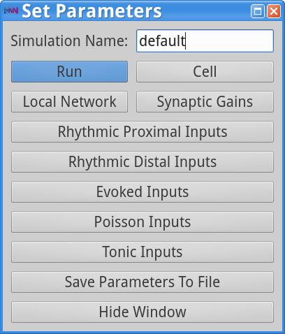</span>

<span class="c0"></span>

<span class="c0">Pressing each button on this dialog brings up a new dialog box with more adjustable parameters. We will go through each below. The next thing to note is the Simulation Name. This should be a unique identifier for any particular simulation you run. HNN also uses this variable to determine where to save the output files. In the dialog displayed, note that the value is set to default. This is because the default.param file was loaded. We suggest you change this name when you make changes to the parameters, before running a new simulation.</span>

<span class="c0"></span>

<span class="c0">Here is an example of the data directory and files saved after running the simulation specified in default.param.</span>

<span class="c0"></span>

<span style="overflow: hidden; display: inline-block; margin: 0.00px 0.00px; border: 0.00px solid #000000; transform: rotate(0.00rad) translateZ(0px); -webkit-transform: rotate(0.00rad) translateZ(0px); width: 442.67px; height: 261.33px;">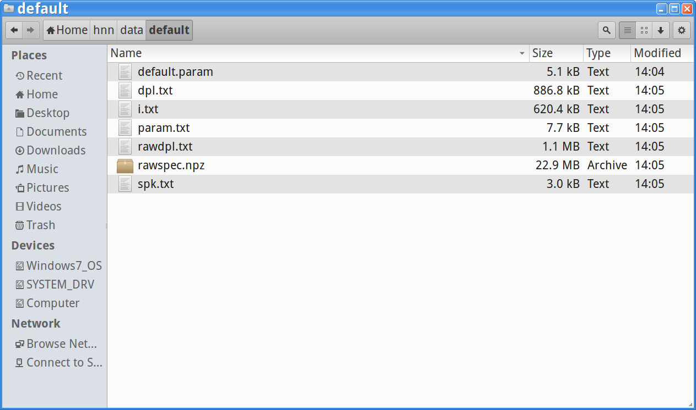</span>

<span class="c0"></span>

<span class="c0">Note that the directory path is /home/hnn/data/default, corresponding to the default Simulation Name parameter specified in the GUI. Also note the individual files present in the window:</span>

1.  <span class="c0">default.param - a backup copy of the param file used to run the simulation</span>
2.  <span class="c0">dpl.txt - normalized dipole in units of nAm; 1st column is time; 2nd column is layer 2 dipole; 3rd column is layer 5 dipole; 45h column is aggregate dipole from layers 2 and 5</span>
3.  <span class="c0">i.txt - currents from the cells</span>
4.  <span class="c0">param.txt - a machine-readable representation of all parameters used to run the simulation</span>
5.  <span class="c0">rawdpl.txt - un-normalized dipole; same columnar layout as dpl.txt</span>
6.  <span class="c0">rawspec.npz - spectrogram from the dipole saved in numpy format; you can use numpy to load this file (note that this file is only produced either when using rhythmic inputs or explicitly asking HNN to save the spectrogram; for the ERP shown above, no spectrogram is saved)</span>
7.  <span class="c0">spk.txt - a list of cell identifiers and spike times</span>

<span class="c0"></span>

<span class="c0">We provide these files for advanced users who want to load them into their own analysis software, and also to allow HNN to load data after a simulation was run. For example, if you close HNN and then restart it, load a param file from a simulation that was already run, HNN will load and display the data.</span>

<span class="c0"></span>

### <span class="c11">Run Parameters</span>

<span class="c0">Pressing the Run button on the Set Parameters dialog box brings up the following dialog, enabling you to view/change the following displayed parameters.</span>

<span class="c0"></span>

<span style="overflow: hidden; display: inline-block; margin: 0.00px 0.00px; border: 0.00px solid #000000; transform: rotate(0.00rad) translateZ(0px); -webkit-transform: rotate(0.00rad) translateZ(0px); width: 193.33px; height: 145.69px;">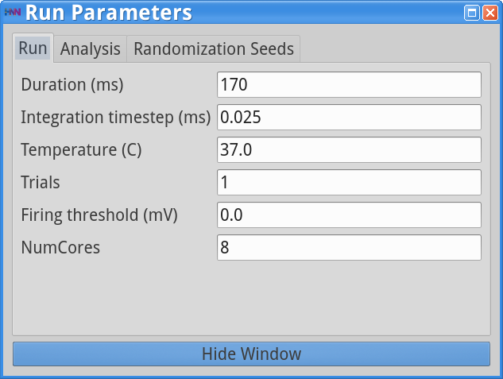</span>

<span class="c0"></span>

*   <span class="c0">Duration (ms) - this sets the simulation duration in milliseconds.</span>
*   <span class="c0">Integration timestep (ms) - this sets the fixed timestep that the NEURON simulator uses to perform integration; smaller values take longer to run but potentially offer more accurate simulations; we recommend using the default value of 0.025 ms.</span>
*   <span class="c0">Temperature (C) - temperature used in simulation</span>
*   <span class="c0">Trials - specifies the number of trials to run; note that the simulation parameters across trials are identical except for inputs which are randomized across trials.</span>
*   <span class="c0">Firing threshold (mV) - neuronal membrane  potential at which the neuron fires an action potential</span>
*   <span class="c0">NumCores - this specifies the number of cores that NEURON will use to run a simulation in parallel; we suggest using the default, which HNN automatically determines based on your computer hardware.</span>

<span class="c0"></span>

<span class="c0">Clicking on the Analysis tab brings up the following parameters.</span>

<span class="c0"></span>

<span style="overflow: hidden; display: inline-block; margin: 0.00px 0.00px; border: 0.00px solid #000000; transform: rotate(0.00rad) translateZ(0px); -webkit-transform: rotate(0.00rad) translateZ(0px); width: 193.33px; height: 145.69px;"></span>

<span class="c0"></span>

*   <span class="c0">Save figures - whether to save figures of model activity when the simulation is run; if set to 1, figures are saved in simulation output directory.</span>
*   <span class="c6">Save spectral data - Whether to save spectral simulation spectral data - time/frequency/power; if set to 1, saved to simulation output directory.</span> <span class="c11">Note: when using rhythmic inputs, spectrograms will be saved whether or not this is set to 1.</span>
*   <span class="c0">Max spectral frequency (Hz) - Maximum frequency used in dipole spectral analysis.</span>
*   <span class="c0">Dipole scaling - Scaling used to match simulation dipole signal to data; implicitly estimates number of cells contributing to dipole signal.</span>
*   <span class="c0">Dipole Smooth Window (ms) - Window size (ms) used for Hamming filtering of dipole signal (0 means no smoothing); for analysis of ongoing rhythms (alpha/beta/gamma), best to avoid smoothing, while for evoked responses, best to smooth with 15-30 ms window.</span>
*   <span class="c0">Save somatic Voltages - to save the somatic voltage from all neurons to an output file set value to 1; enables drawing somatic voltage from HNN View menu after simulation is run with this setting turned on</span>

<span class="c0"></span>

<span class="c0">Clicking on the Randomization Seeds tab brings up the following parameters.</span>

<span class="c0"></span>

<span style="overflow: hidden; display: inline-block; margin: 0.00px 0.00px; border: 0.00px solid #000000; transform: rotate(0.00rad) translateZ(0px); -webkit-transform: rotate(0.00rad) translateZ(0px); width: 193.33px; height: 145.69px;">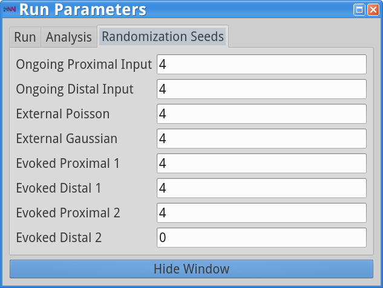</span>

<span class="c0"></span>

<span class="c6">All these parameters are random number generator seeds for the different types of</span> <span class="c4">inputs</span><span class="c0"> provided to the model. Varying a seed will still maintain statistically identical inputs but allow for controlled variability.</span>

*   <span class="c0">Random number generator seed used for rhythmic proximal inputs.</span>
*   <span class="c0">Random number generator seed used for rhythmic distal inputs.</span>
*   <span class="c0">Random number generator seed used for Poisson inputs.</span>
*   <span class="c0">Random number generator seed used for Gaussian inputs.</span>
*   <span class="c0">Random number generator seed used for evoked proximal input 1.</span>
*   <span class="c0">Random number generator seed used for evoked distal input 1.</span>
*   <span class="c0">Random number generator seed used for evoked proximal input 2.</span>
*   <span class="c0">Random number generator seed used for evoked distal input 2.</span>

<span class="c0"></span>

### <span class="c11">Cell Parameters</span>

<span class="c0">Pressing the Cell button on the Set Parameters dialog box brings up the following dialog, enabling you to view/change the cell parameters associated with geometry, synapses, and biophysics for layer 2/3 and layer 5 pyramidal neurons.</span>

<span class="c0"></span>

<span class="c0">These parameters control the cell’s geometry:</span>

<span class="c0"></span>

<span style="overflow: hidden; display: inline-block; margin: 0.00px 0.00px; border: 0.00px solid #000000; transform: rotate(0.00rad) translateZ(0px); -webkit-transform: rotate(0.00rad) translateZ(0px); width: 193.33px; height: 321.00px;"></span>

<span class="c0"></span>

<span class="c0">and include lengths/diameters of individual compartments. Although not strictly related, we have also included axial resistivity and capacitive in this panel.</span>

<span class="c0"></span>

<span class="c0">Clicking on the L2/3 Pyr Synapses tab allows you to modify the postsynaptic properties of layer 2/3 pyramidal neurons:</span>

<span class="c0"></span>

<span style="overflow: hidden; display: inline-block; margin: 0.00px 0.00px; border: 0.00px solid #000000; transform: rotate(0.00rad) translateZ(0px); -webkit-transform: rotate(0.00rad) translateZ(0px); width: 193.33px; height: 321.00px;">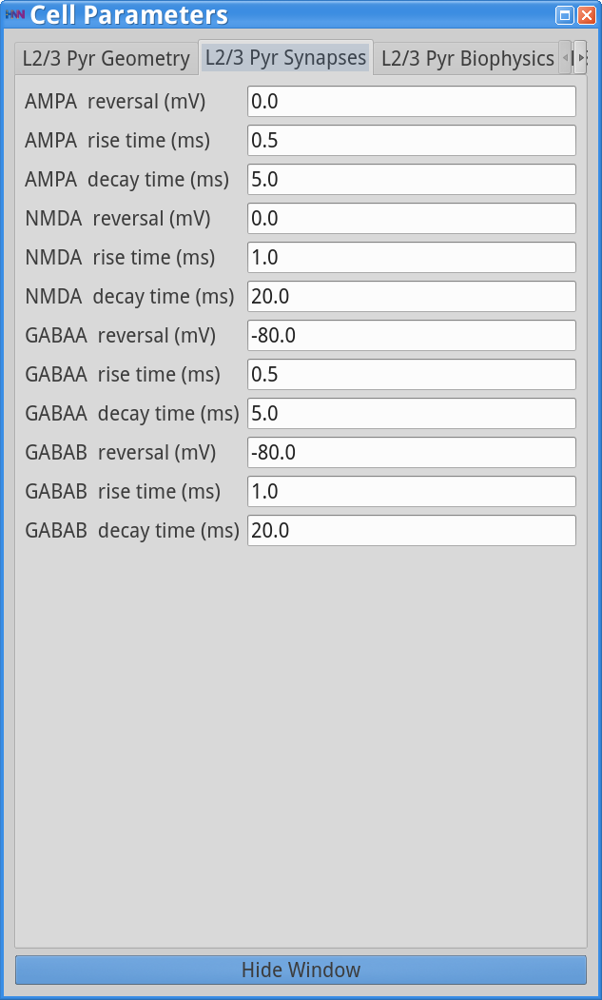</span>

<span class="c0"></span>

<span class="c0">These include the excitatory (AMPA/NMDA) and inhibitory (GABAA/GABAB) reversal potentials and rise/decay exponential time-constants.</span>

<span class="c0"></span>

<span class="c0">Clicking on the L2/3 Pyr Biophysics tab allows you to modify the biophysical properties of layer 2 pyramidal neurons, including ion channel densities and reversal potentials:</span>

<span class="c0"></span>

<span style="overflow: hidden; display: inline-block; margin: 0.00px 0.00px; border: 0.00px solid #000000; transform: rotate(0.00rad) translateZ(0px); -webkit-transform: rotate(0.00rad) translateZ(0px); width: 193.33px; height: 321.00px;"></span>

<span class="c0"></span>

<span class="c0">To modify properties of the layer 5 pyramidal neurons, click on the right arrow to access the relevant tabs (beginning with L5 Pyr).</span>

<span class="c0"></span>

### <span class="c11">Local Network Parameters</span>

<span class="c6">Neurons in the model are arranged in three dimensions. The</span> <span class="c4">XY</span><span class="c0"> plane is used to array cells on a regular grid (arbitrary units) while the Z-axis specifies cortical layer (position in microns).</span>

<span class="c0"></span>

<span style="overflow: hidden; display: inline-block; margin: 0.00px 0.00px; border: 0.00px solid #000000; transform: rotate(0.00rad) translateZ(0px); -webkit-transform: rotate(0.00rad) translateZ(0px); width: 177.33px; height: 197.33px;">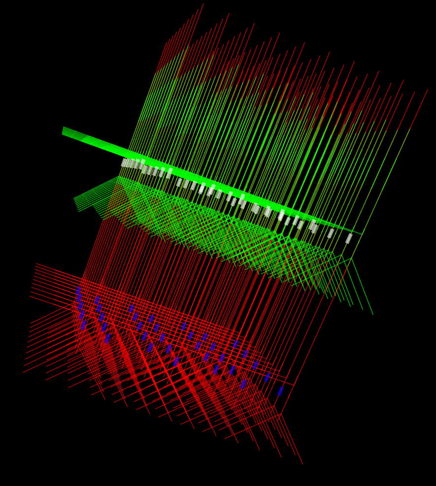</span>

<span class="c0"></span>

<span class="c0">This 3D visualization of the model is rotated to allow easier viewing. The top and bottom represent supra- and infragranular cortical layers. In this figure, the following color code is used for the different cell types in the model– red: layer 5 pyramidal neurons; green: layer 2/3 pyramidal neurons; white: layer 2/3 interneurons; blue: layer 5 interneurons.</span>

<span class="c0"></span>

<span style="overflow: hidden; display: inline-block; margin: 0.00px 0.00px; border: 0.00px solid #000000; transform: rotate(0.00rad) translateZ(0px); -webkit-transform: rotate(0.00rad) translateZ(0px); width: 213.42px; height: 221.50px;">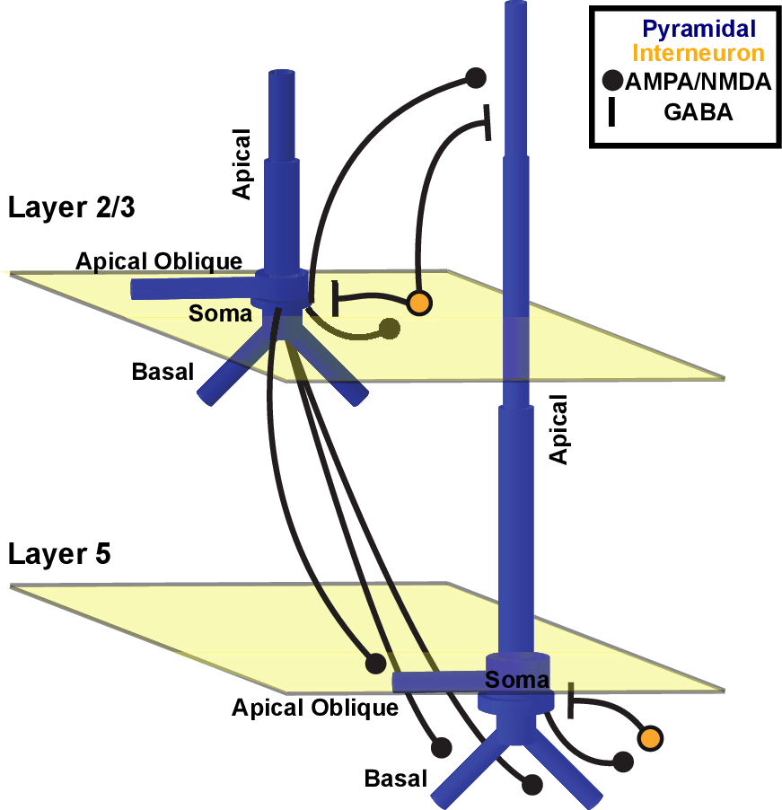</span>

<span class="c0"></span>

<span class="c0">The figure above shows a schematic of network connectivity. The blue cells are pyramidal neurons, while the orange circles represent the interneurons. The lines between neurons represent local synaptic connections. Lines ending with a circle are excitatory (AMPA/NMDA) synapses, while lines ending with a line are inhibitory (GABAA/GABAB) synapses.</span>

<span class="c0"></span>

<span class="c6">Pressing the Local Network button on the Set Parameters dialog box brings up the following dialog, enabling you to view/change the local network microcircuit parameters including number of cells and synaptic weights between cells of specific types. These parameters control the number of pyramidal cells in the</span> <span class="c4">X</span><span class="c6">and</span> <span class="c4">Y</span><span class="c0"> directions per cortical layer:</span>

<span class="c0"></span>

<span style="overflow: hidden; display: inline-block; margin: 0.00px 0.00px; border: 0.00px solid #000000; transform: rotate(0.00rad) translateZ(0px); -webkit-transform: rotate(0.00rad) translateZ(0px); width: 193.33px; height: 120.64px;">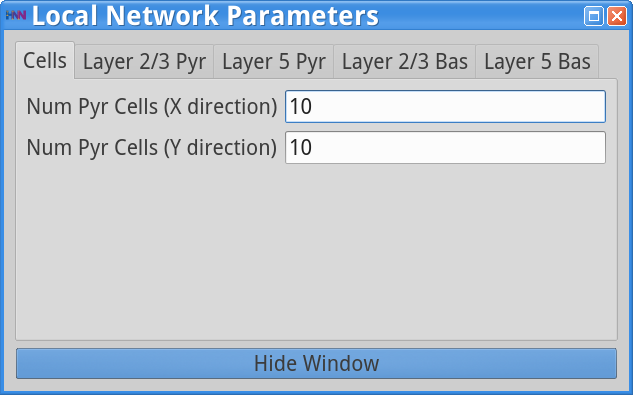</span>

<span class="c0"></span>

<span class="c6">Note that the pyramidal cells are arranged in the</span> <span class="c4">XY</span><span class="c6">plane, so the number of cells in a layer is the product of the number along the X and Y directions.</span> <span class="c6">The number of interneurons per layer is adjusted to be ⅓ the number of pyramidal neurons in an equally distributed configuration</span><span class="c0">.</span>

<span class="c0"></span>

<span class="c0">To adjust synaptic weights onto a particular cell type, click the corresponding tab in the dialog. For example, the following dialog allows viewing/setting the synaptic weights onto layer 2/3 pyramidal neurons:</span>

<span class="c0"></span>

<span style="overflow: hidden; display: inline-block; margin: 0.00px 0.00px; border: 0.00px solid #000000; transform: rotate(0.00rad) translateZ(0px); -webkit-transform: rotate(0.00rad) translateZ(0px); width: 193.33px; height: 120.64px;">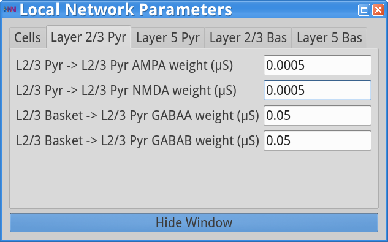</span>

<span class="c0"></span>

<span class="c6">In this example, AMPA/NMDA weight are the excitatory synaptic weights, while GABAA/GABAB are the inhibitory synaptic weights. All weights are specified in units of conductance (</span><span class="c6">). Note that the synaptic weight,</span> <span class="c4">w</span><span class="c6">, between two cells is scaled by the distance between the two cells through the following equation:</span><span class="c6">, where</span> <span class="c4">w</span><span class="c6">is the weight specified in the dialog,</span> <span class="c4">d</span><span class="c6">is the distance between the cells in the</span> <span class="c4">XY</span><span class="c6">plane (distance is in arbitrary units), and</span> <span class="c4">λ</span><span class="c6"> is a spatial length constant which is 3 or 20 (</span><span class="c4">λ</span> <span class="c6">is also in arbitrary units)</span> <span class="c0">when a presynaptic cell is excitatory or inhibitory, respectively, in order to have shorter spread of excitation relative to inhibition.</span>

<span class="c0"></span>

<span class="c6">Excitatory (E) and inhibitory (I)</span> <span class="c4">tone</span><span class="c0"> within the network is a major factor influencing network dynamics. The following dialog, accessible with the Synaptic Gains button from the main Set Parameters dialog, facilitates scaling of E->E, E->I, I->E, and I->I weights, without having to adjust the weights between specific types of cells.</span>

<span class="c0"></span>

<span style="overflow: hidden; display: inline-block; margin: 0.00px 0.00px; border: 0.00px solid #000000; transform: rotate(0.00rad) translateZ(0px); -webkit-transform: rotate(0.00rad) translateZ(0px); width: 110.67px; height: 107.08px;">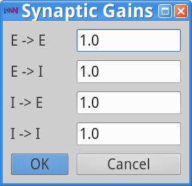</span>

<span class="c0"></span>

<span class="c0">In this dialog changing the 1.0 to other values and pressing OK will multiply the appropriate weights displayed in the Local Network Parameter dialog. For example, setting E->E to a value of 2.0 will double the weights between all pairs of excitatory cells. Changing a value and then pressing Cancel will produce no effect.</span>

<span class="c0"></span>

### <span class="c25">Synaptic Inputs -</span> <span class="c24">Proximal</span><span class="c25">vs</span> <span class="c24 c28">Distal</span>

<span class="c6">For both rhythmic and evoked synaptic inputs (described below) we use the terms</span> <span class="c4">proximal</span><span class="c6">and</span> <span class="c4">distal</span><span class="c0"> to refer both to the origin of the inputs as well as the laminar target within the neocortical microcircuit. Proximal inputs refers to inputs arriving from lemniscal thalamus, which primarily target the granular and infragranular layers while distal inputs arrive from non-lemniscal thalamus and cortico-cortical feedback, which primarily target the supragranular layers. These differences are illustrated in schematics in several places in the HNN GUI, and also shown here.</span>

<span class="c0"></span>

<a id="t.f11015277bcded324466189188e45937ffd3c154"></a><a id="t.0"></a>

<table class="c17">

<tbody>

<tr class="c22">

<td class="c13" colspan="1" rowspan="1">

<span class="c0"></span>

</td>

<td class="c13" colspan="1" rowspan="1">

<span style="overflow: hidden; display: inline-block; margin: 0.00px 0.00px; border: 0.00px solid #000000; transform: rotate(0.00rad) translateZ(0px); -webkit-transform: rotate(0.00rad) translateZ(0px); width: 134.67px; height: 150.67px;">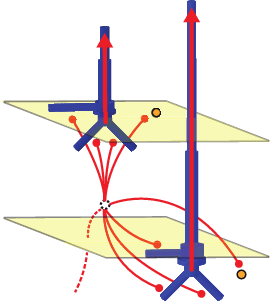</span>

</td>

<td class="c13" colspan="1" rowspan="1">

<span style="overflow: hidden; display: inline-block; margin: 0.00px 0.00px; border: 0.00px solid #000000; transform: rotate(0.00rad) translateZ(0px); -webkit-transform: rotate(0.00rad) translateZ(0px); width: 134.67px; height: 150.67px;">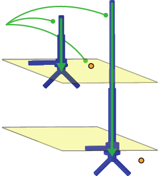</span>

</td>

<td class="c13" colspan="1" rowspan="1">

<span class="c0">  
</span>

</td>

</tr>

</tbody>

</table>

<span class="c0"></span>

<span class="c6">The left schematic here shows proximal inputs which target basal dendrites of layer 2 and layer 5 pyramidal neurons, and somata of layer 2 and layer 5 interneurons. The red arrows indicate that these proximal inputs</span> <span class="c4">push</span><span class="c6">the current flow up the dendrites towards supragranular layers. The right schematic shows distal inputs which target the distal apical dendrites of layer 5 and layer 2 pyramidal neurons and the somata of layer 2 interneurons. The green arrows indicate that these distal inputs</span> <span class="c4">push</span><span class="c0"> the current flow down towards the infragranular layers.</span>

<span class="c0"></span>

### <span class="c11">Rhythmic Inputs (Synaptic)</span>

<span class="c0">You can provide rhythmic inputs throughout a simulation, or for a fixed interval within the simulation using the Rhythmic Proximal Inputs and Rhythmic Distal Inputs dialogs available from the main Set Parameters dialog window.</span>

<span class="c0"></span>

<span class="c6">Rhythmic inputs are selected using an average frequency with variability. The resulting synaptic events can be repeated multiple times to create further variability and more inputs. Each</span> <span class="c4">burst</span><span class="c0"> selects a set of events from a distribution with average starting time, interval (frequency), and appropriate ending time. Each input is sent to the synapses of the appropriate compartments (basal vs apical dendrites, etc.) of the appropriate neurons.</span>

<span class="c0"></span>

<span style="overflow: hidden; display: inline-block; margin: 0.00px 0.00px; border: 0.00px solid #000000; transform: rotate(0.00rad) translateZ(0px); -webkit-transform: rotate(0.00rad) translateZ(0px); width: 144.50px; height: 200.24px;">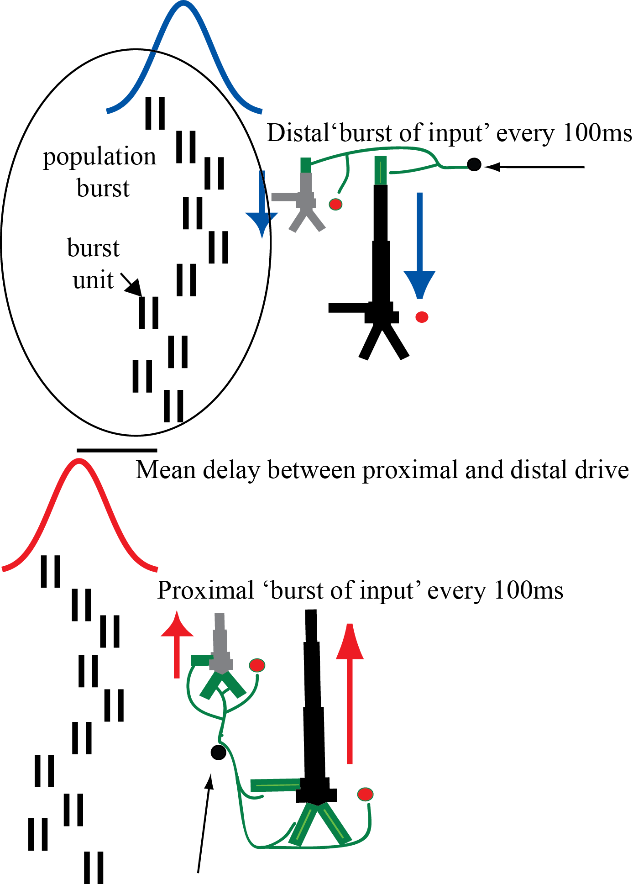</span>

<span class="c0"></span>

<span class="c0">Schematic illustration of rhythmic 10 Hz burst drive through proximal and distal projection pathways.  “Population bursts”, consisting of a set number of “burst units” (10, 2-spike bursts shown)  drive post-synaptic conductances in the local network with a set frequency (100 ms ISI) and mean delay between proximal and distal.  </span>

<span class="c0"></span>

<a id="t.4ddb8f843d82ffd23098bf8aea89b4b1c103b929"></a><a id="t.1"></a>

<table class="c17">

<tbody>

<tr class="c29">

<td class="c10" colspan="1" rowspan="1">

<span style="overflow: hidden; display: inline-block; margin: 0.00px 0.00px; border: 0.00px solid #000000; transform: rotate(0.00rad) translateZ(0px); -webkit-transform: rotate(0.00rad) translateZ(0px); width: 193.33px; height: 238.84px;"></span>

</td>

<td class="c10" colspan="1" rowspan="1">

<span style="overflow: hidden; display: inline-block; margin: 0.00px 0.00px; border: 0.00px solid #000000; transform: rotate(0.00rad) translateZ(0px); -webkit-transform: rotate(0.00rad) translateZ(0px); width: 193.33px; height: 238.84px;">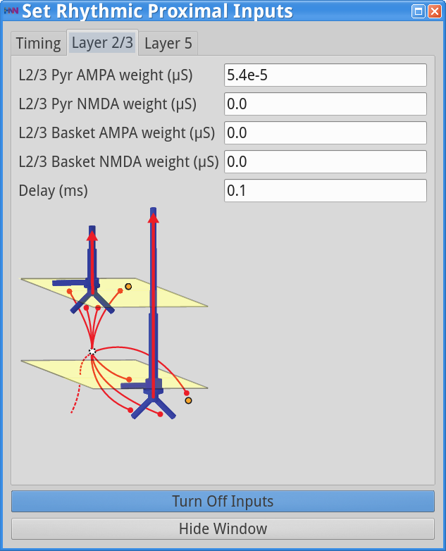</span>

</td>

<td class="c10" colspan="1" rowspan="1">

<span style="overflow: hidden; display: inline-block; margin: 0.00px 0.00px; border: 0.00px solid #000000; transform: rotate(0.00rad) translateZ(0px); -webkit-transform: rotate(0.00rad) translateZ(0px); width: 193.33px; height: 238.84px;">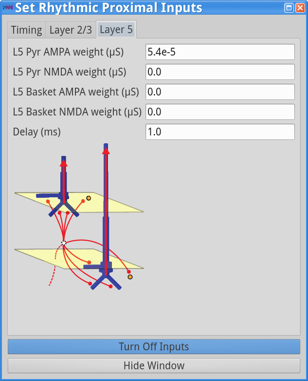</span>

</td>

</tr>

</tbody>

</table>

<span class="c0"></span>

<a id="t.4ddb8f843d82ffd23098bf8aea89b4b1c103b929"></a><a id="t.2"></a>

<table class="c17">

<tbody>

<tr class="c30">

<td class="c9" colspan="1" rowspan="1">

<span style="overflow: hidden; display: inline-block; margin: 0.00px 0.00px; border: 0.00px solid #000000; transform: rotate(0.00rad) translateZ(0px); -webkit-transform: rotate(0.00rad) translateZ(0px); width: 193.33px; height: 238.84px;">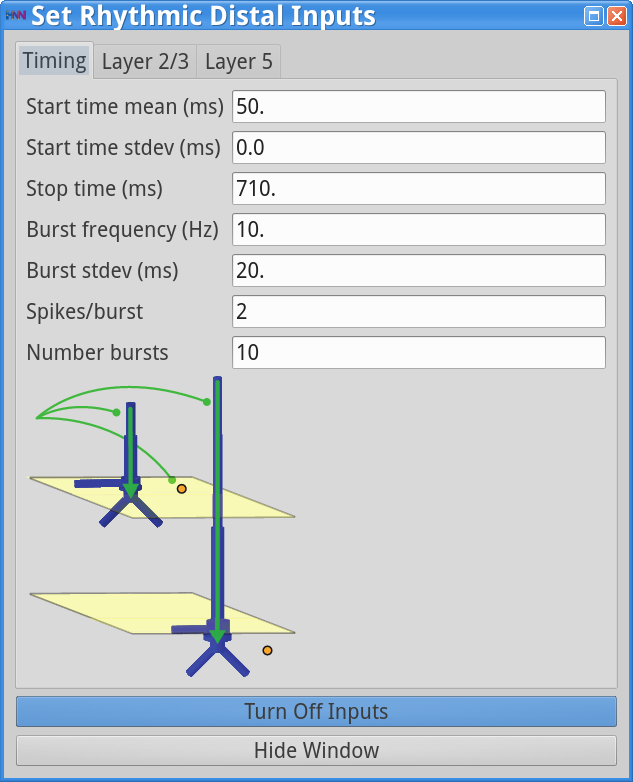</span>

</td>

<td class="c9" colspan="1" rowspan="1">

<span style="overflow: hidden; display: inline-block; margin: 0.00px 0.00px; border: 0.00px solid #000000; transform: rotate(0.00rad) translateZ(0px); -webkit-transform: rotate(0.00rad) translateZ(0px); width: 193.33px; height: 238.84px;"></span>

</td>

<td class="c9" colspan="1" rowspan="1">

<span style="overflow: hidden; display: inline-block; margin: 0.00px 0.00px; border: 0.00px solid #000000; transform: rotate(0.00rad) translateZ(0px); -webkit-transform: rotate(0.00rad) translateZ(0px); width: 193.33px; height: 238.84px;">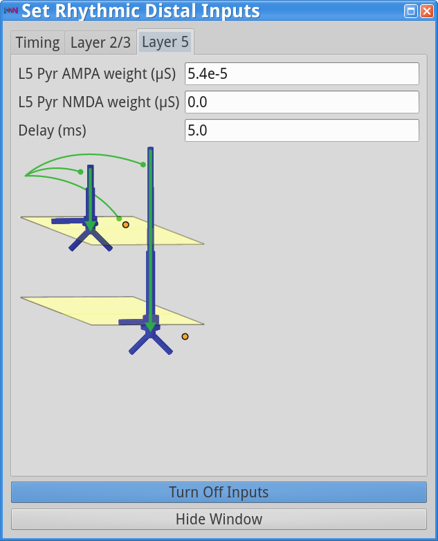</span>

</td>

</tr>

</tbody>

</table>

<span class="c0"></span>

<span class="c0">As mentioned above, proximal and distal inputs target different cortical layers. However, you can set their start/stop times and frequencies using the same specification. This is shown in the left-most panels above:</span>

*   <span class="c0">Start time mean (ms) - specifies the average start time for rhythmic inputs</span>
*   <span class="c0">Start time stdev (ms) - specifies the standard deviation of start times for rhythmic inputs</span>
*   <span class="c0">Stop time (ms) - specifies when the rhythmic inputs should be turned off</span>
*   <span class="c0">Burst frequency (Hz) - average frequency of bursts</span>
*   <span class="c0">Burst stdev (ms) - standard deviation of input events</span>
*   <span class="c6">Spikes/burst - must be set to 1 or 2; provides</span> <span class="c4">n</span><span class="c0"> synaptic events at each selected time</span>
*   <span class="c0">Number bursts - how many times should the full Burst sequence get repeated (each repeat adds variability and more inputs)</span>

<span class="c0"></span>

<span class="c0">The middle and right panels above allow you to set the weights of the rhythmic synaptic inputs (units of conductance) and add delays (ms) before the cells receive the events to layers 2/3 and 5, respectively. Note that the Turn Off Inputs button shown on the two dialogs above is a shorthand, allowing you to set the weights of rhythmic or proximal synaptic inputs to 0.0, effectively shutting them off.</span>

<span class="c0"></span>

### <span class="c11">Evoked Inputs (Synaptic)</span>

<span class="c0">Evoked inputs are used to model event related potentials (ERPs) and are typically set to produce neuronal spiking. To set Evoked Input parameters, press the Evoked Inputs button on the main Set Parameters dialog window. Evoked Inputs use the proximal/distal notation mentioned above. You will be able to set an arbitrary number of evoked inputs using the Add Proximal Input and Add Distal Input button shown.</span>

<span class="c0"></span>

<a id="t.f727949b760321cc972232d42b2d9fa1f8785d82"></a><a id="t.3"></a>

<table class="c21">

<tbody>

<tr class="c8">

<td class="c27" colspan="1" rowspan="1">

<span style="overflow: hidden; display: inline-block; margin: 0.00px 0.00px; border: 0.00px solid #000000; transform: rotate(0.00rad) translateZ(0px); -webkit-transform: rotate(0.00rad) translateZ(0px); width: 171.77px; height: 391.56px;">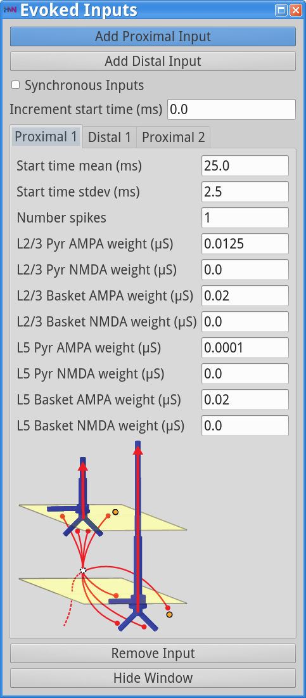</span>

</td>

<td class="c27" colspan="1" rowspan="1">

<span style="overflow: hidden; display: inline-block; margin: 0.00px 0.00px; border: 0.00px solid #000000; transform: rotate(0.00rad) translateZ(0px); -webkit-transform: rotate(0.00rad) translateZ(0px); width: 172.78px; height: 393.85px;">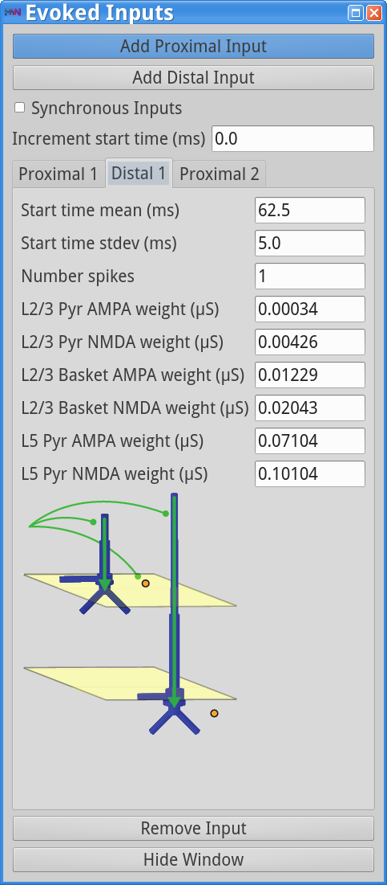</span>

</td>

</tr>

</tbody>

</table>

<span class="c0"></span>

<span class="c0">Proximal and distal inputs are numbered sequentially. In the example shown, there are 2 Proximal and 1 Distal inputs. The following parameter values are used:</span>

*   <span class="c0">Start time mean (ms) - average start time</span>
*   <span class="c0">Start time stdev (ms) - standard deviation of start time</span>
*   <span class="c0">Number spikes - number of inputs provided to each synapse</span>
*   <span class="c6">L2/3 Pyr weight AMPA/NMDA (</span><span class="c0">) - weight of AMPA/NMDA synaptic inputs to layer 2 pyramidal neurons</span>
*   <span class="c6">L2/3 Basket weight AMPA/NMDA (</span><span class="c0">) - weight of AMPA/NMDA synaptic inputs to layer 2 basket cells</span>
*   <span class="c6">L5 Pyr weight AMPA/NMDA (</span><span class="c0">) - weight of AMPA/NMDA synaptic inputs to layer 5 pyramidal neurons</span>
*   <span class="c6">L5 Basket weight AMPA/NMDA (</span><span class="c6">) - weight of AMPA/NMDA synaptic inputs to layer 5 basket cells (only used for</span> <span class="c4">proximal</span><span class="c0"> inputs)</span>

<span class="c0"></span>

<span class="c0">Synchronous Inputs indicates whether for a specific evoked proximal/distal input each neuron receives the input at the same time, or if instead each neuron receives the evoked input events independently drawn from the same distribution. Increment input (ms) indicates whether to increment the Start time of all evoked inputs on each trial. To remove the input shown in the currently active tab, press the Remove Input button.</span>

<span class="c0"></span>

### <span class="c11">Poisson Inputs (Synaptic)</span>

<span class="c0">Poisson Inputs, are excitatory AMPA or NMDA synaptic inputs to the somata of different neurons, which follow a Poisson Process. The parameters to control them are accessed via the dialog brought up when pressing the Poisson Inputs button on the main Set Parameters dialog window.</span>

<span class="c0"></span>

<a id="t.4ddb8f843d82ffd23098bf8aea89b4b1c103b929"></a><a id="t.4"></a>

<table class="c21">

<tbody>

<tr class="c19">

<td class="c7" colspan="1" rowspan="1">

<span style="overflow: hidden; display: inline-block; margin: 0.00px 0.00px; border: 0.00px solid #000000; transform: rotate(0.00rad) translateZ(0px); -webkit-transform: rotate(0.00rad) translateZ(0px); width: 193.33px; height: 132.55px;"></span>

</td>

<td class="c7" colspan="1" rowspan="1">

<span style="overflow: hidden; display: inline-block; margin: 0.00px 0.00px; border: 0.00px solid #000000; transform: rotate(0.00rad) translateZ(0px); -webkit-transform: rotate(0.00rad) translateZ(0px); width: 193.33px; height: 132.55px;"></span>

</td>

<td class="c7" colspan="1" rowspan="1">

<span style="overflow: hidden; display: inline-block; margin: 0.00px 0.00px; border: 0.00px solid #000000; transform: rotate(0.00rad) translateZ(0px); -webkit-transform: rotate(0.00rad) translateZ(0px); width: 193.33px; height: 132.55px;"></span>

</td>

</tr>

</tbody>

</table>

<span class="c0"></span>

<span class="c6">As shown above, the Poisson synaptic input frequency weights are set individually for each type of neuron and synapse (AMPA, NMDA). The timing tab of the dialog allows you to set the start and stop time of Poisson-generated events.</span> <span class="c11">Note: a Stop time of -1 means that events are generated until the end of the simulation.</span>

<span class="c11"></span>

### <span class="c11">Tonic Inputs (Current Clamp)</span>

<span class="c4">Tonic</span><span class="c0"> inputs are modeled as somatic current clamps with a fixed current injection. These clamps can be used to adjust the resting membrane potential of a neuron, and bring it closer (with positive amplitude injection) or further from firing threshold (with a negative amplitude injection).</span>

<span class="c0"></span>

<a id="t.f727949b760321cc972232d42b2d9fa1f8785d82"></a><a id="t.5"></a>

<table class="c21">

<tbody>

<tr class="c23">

<td class="c16" colspan="1" rowspan="1">

<span style="overflow: hidden; display: inline-block; margin: 0.00px 0.00px; border: 0.00px solid #000000; transform: rotate(0.00rad) translateZ(0px); -webkit-transform: rotate(0.00rad) translateZ(0px); width: 193.33px; height: 132.55px;">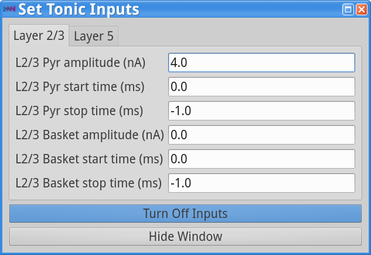</span>

</td>

<td class="c16" colspan="1" rowspan="1">

<span style="overflow: hidden; display: inline-block; margin: 0.00px 0.00px; border: 0.00px solid #000000; transform: rotate(0.00rad) translateZ(0px); -webkit-transform: rotate(0.00rad) translateZ(0px); width: 193.33px; height: 132.55px;">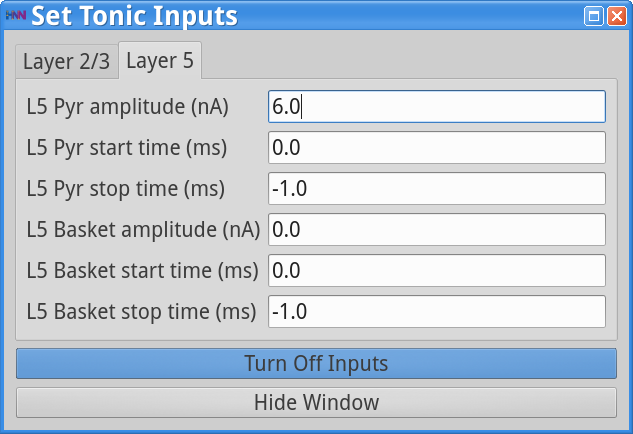</span>

</td>

</tr>

</tbody>

</table>

<span class="c0"></span>

<span class="c6">As shown above, you can set the current clamp amplitude, and start/stop time for each neuron type.</span> <span class="c11">Note: Stop time of -1 means that the clamp is applied until the end of the simulation.</span>

<span class="c0"></span>


```python

```
