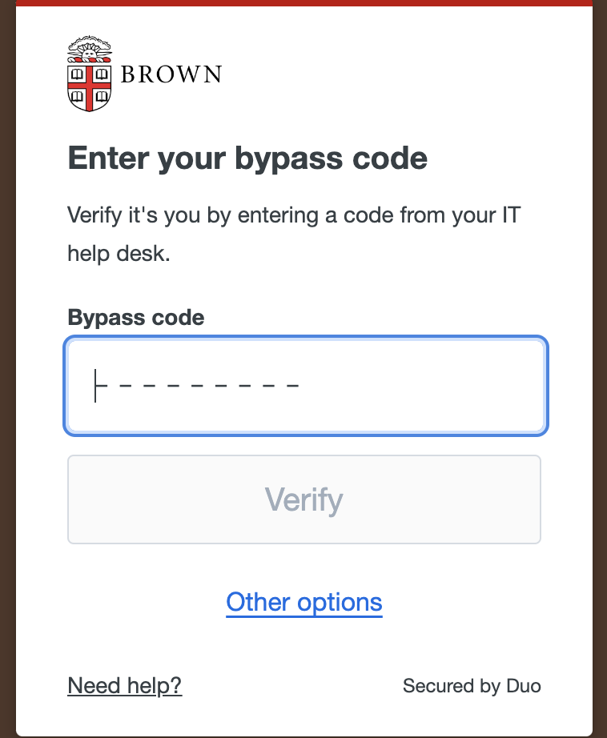

**Table of Contents**

- [Logging into the Oscar Virtual Environment](#logging-into-the-oscar-virtual-environment)
- [Launching HNN-Core GUI via Oscar](#launching-hnn-core-gui-via-oscar)
- [Launching HNN-Core (Python) via Oscar](#launching-hnn-core-python-via-oscar)
- [Cloning the HNN-Data Repository](#cloning-the-hnn-data-repository)
- [Installing HNN-Core GUI on Your Local Machine via Conda](#installing-hnn-core-gui-on-your-local-machine-via-conda)


## Logging into the Oscar Virtual Environment
1. Go to Oscar-on-Demand (OOD): [ood.ccv.brown.edu/pun/sys/dashboard/batch_connect/sessions](https://ood.ccv.brown.edu/pun/sys/dashboard/batch_connect/sessions)

2. Select a username from the <a href="https://docs.google.com/spreadsheets/d/1NQuCULv6Nmo1n7cHnsD5ZnEYtnxPeYUWzRBvaXFvliA/edit?usp=sharing">following spreadsheet</a> and add an "X" to the appropriate cell. The "X" is to indicate that the username you selected is "in use" so another participant doesn't try to log in with the same username/bypass code

3. Enter your selected username into 'Username' field of the login page

4. Enter the password: HNNws2024*

<div style="max-width: 400px;">


</div>


5. From the DUO authentication screen, select "Other options" and then choose "Bypass code"

<span style="max-width:800px">

|  |  |  |
|-----------------------------|-----------------------------|-----------------------------|

6. Enter the bypass code associated with the username you selected in Step 2

</span>


## Launching HNN-Core GUI via Oscar
With the Oscar desktop instance open, open a terminal and type the following to activate the environment.

```bash
module purge
module load python/3.11
module load  hpcx-mpi/4.1.5rc2
source /oscar/data/ccv_workshop/hnn_env/bin/activate
```

Within the same terminal with the `hnn_env` activated, type the following to launch the GUI.
```bash
hnn-gui
```

## Launching HNN-Core (Python) via Oscar
From the Oscar virtual desktop, open a terminal and run the following commands.

```bash
module load hnn-workshop/2023.11
module load miniconda/4.12.0 firefox/87.0
source /oscar/runtime/opt/hnn-workshop/2023.11/bin/activate

git clone <https://github.com/jasmainak/hnn-workshop-materials.git>
cd hnn-workshop-materials/
jupyter notebook &
```

## Cloning the HNN-Data Repository
To follow along with the workshop, you'll need to clone the [hnn-data repository](https://github.com/jonescompneurolab/hnn-data) to your local machine.

To do so, launch a terminal and run the following command.

```bash
git clone https://github.com/jonescompneurolab/hnn-data.git
```

If you already have the hnn-data repo on your machine, be sure to update it to include the latest changes

```bash
cd hnn-data
git pull
```

## Installing HNN-Core GUI on Your Local Machine via Conda
Start by creating a new conda environment. We recommend creating an environment with the fewest number of dependencies to speed up the installation process.

```bash
conda create --name hnn_core_gui python=3.11 --no-default-packages
conda activate hnn_core_gui
pip install --pre hnn-core[gui]
```

To run simulations in parallel across multiple cores, which dramatically speeds up siuations, you'll need to set up the MPI backend.

```bash
conda activate hnn_core_gui # activate the environment if needed
conda install -y openmpi mpi4py
pip install psutil
export DYLD_FALLBACK_LIBRARY_PATH=${CONDA_PREFIX}/lib
```

You can now launch the GUI from within your conda environemnt.

```bash
conda activate hnn_core_gui # activate the environment if needed
hnn-gui
```

