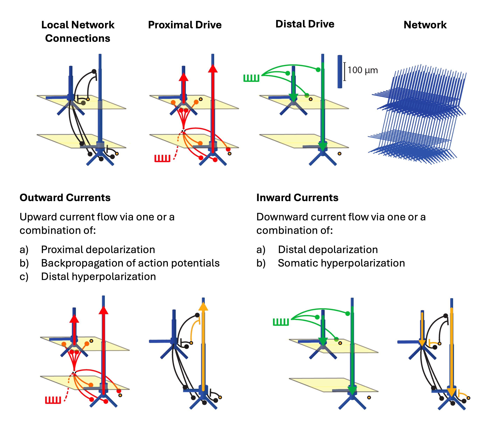

**Table of Contents**

- [Workshop Sign-In (Optional but Encouraged)](#workshop-sign-in-optional-but-encouraged)
- [Workshop Materials](#workshop-materials)
  - [HNN-Core GUI Tutorial](#hnn-core-gui-tutorial)
  - [HNN-Core Python Tutorial](#hnn-core-python-tutorial)
- [Installing HNN-Core GUI Locally](#installing-hnn-core-gui-locally)
  - [Installing on Your Local Machine without Conda](#installing-on-your-local-machine-without-conda)
  - [Installing on Your Local Machine with Conda](#installing-on-your-local-machine-with-conda)
    - [Creating a Conda Env and Installing Dependencies](#creating-a-conda-env-and-installing-dependencies)
    - [Installing MPI for Parallel Simulations](#installing-mpi-for-parallel-simulations)
    - [Launch the GUI](#launch-the-gui)


# Workshop Sign-In (Optional but Encouraged)

Please consider 'signing in' to the workshop by providing your institution/location, position, and field of study. This information is used in reporting on milestones for the grants that continue to fund our dissemination and development. We don't ask for name or email, and the form should take no more than 30 seconds to complete.

Click [here](https://forms.gle/YnZX9ZRm8WvWpAGU7) to navigate to our Virtual Sign-In Form.

<p>Thanks for your support. &#128513;</p>


# Workshop Materials

## HNN-Core GUI Tutorial

This section of the workshop will require you to use HNN-Core GUI.


We have created a Google CoLab notebook that allows you to run the HNN-Core GUI out of your browser, with access to your local filesystem.

This is the quickest way to get up and running with HNN-Core GUI, though it does require a Google Account. If you do not have a Google account, you can either create one for free to run the notebook, or try one of the other installation methods listed below.

Click <a href="https://colab.research.google.com/drive/1yyjuEBimIu_f7_0Nf3YLwUiVOO7ZrKK3?usp=sharing">here</a> to open the CoLab notebook, which includes instructions on how to get started.

To follow along with the workshop, you'll also need to clone or download the [hnn-data repository](https://github.com/jonescompneurolab/hnn-data).

Click [here](https://github.com/jonescompneurolab/hnn-data/archive/refs/heads/main.zip) to download the hnn-data folder directly. Altenatively, you can clone the repository with the follwing command.

```bash
git clone https://github.com/jonescompneurolab/hnn-data.git
```

We will also reference the schematic below throughout the workshop, and we include it here for your reference. 

{ width=1000px }

## HNN-Core Python Tutorial

The HNN-Core Python tutorial will utilize the following Google CoLab notebook, which can also be downloaded as an .ipynb file and run locally: [hnn-workshop-materials](https://colab.research.google.com/drive/1CvNTB_puonJiVvHmFhKhrr_CjmrfbgVB?usp=sharing)


# Installing HNN-Core GUI Locally

## Installing on Your Local Machine without Conda

You can easily install HNN-Core GUI on your local machine with pip.

To do so, open a Terminal and and enter the following command:

**For bash/Powershell**
```bash
pip install --pre hnn-core[gui]
```

**For zsh**
```bash
pip install --pre hnn-core'[gui]'
```

Once installed, you can launch the GUI with the following command.

```bash
hnn-gui
```

Note that you will not be able to utilize the MPI backend to run simulation in parallel without also installing MPI on your machine. We recommend using the Conda install method below if you would like to utilize MPI, as it significantly streamlines the MPI setup process.

For our workshops, we will be running simulations with only a few trials at most, and so MPI is not strictly necessary to keep up with the materials.


## Installing on Your Local Machine with Conda

### Creating a Conda Env and Installing Dependencies

**Note**: We recommend using use Windows Subsystem for Linux (WSL) to run HNN on Windows machines. Installation instructions can be found <a href="https://learn.microsoft.com/en-us/windows/wsl/install">here</a>

Start by creating a new conda environment. We recommend creating an environment with the fewest number of dependencies to speed up the installation process.

```bash
conda create --name hnn_core_gui python=3.11 --no-default-packages
conda activate hnn_core_gui
pip install --pre hnn-core[gui]
```

### Installing MPI for Parallel Simulations

To run simulations in parallel across multiple cores, which dramatically speeds up siuations, you'll need to set up the MPI backend.

```bash
conda activate hnn_core_gui # activate the environment if needed
conda install -y openmpi mpi4py
pip install psutil
```

Additionally, for MacOS, run the following command.
```bash
export DYLD_FALLBACK_LIBRARY_PATH=${CONDA_PREFIX}/lib
```

More detailedd instructions are available on our <a href="https://jonescompneurolab.github.io/hnn-core/stable/parallel.html">parallel backends</a> page. 

### Launch the GUI

You can now launch the GUI from within your conda environemnt.

```bash
conda activate hnn_core_gui # activate the environment if needed
hnn-gui
```

