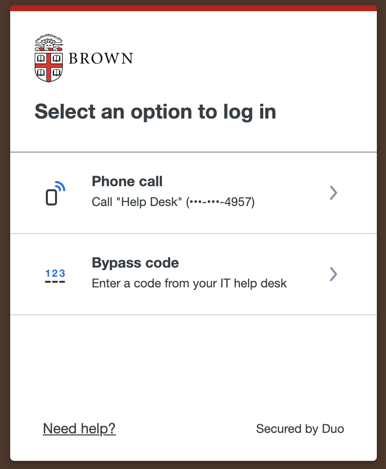

**Table of Contents**

- [Logging into the Oscar Virtual Environment](#logging-into-the-oscar-virtual-environment)
- [Launching the Desktop App on Oscar](#launching-the-desktop-app-on-oscar)
- [Launching HNN-Core GUI via Oscar](#launching-hnn-core-gui-via-oscar)
- [Launching HNN-Core (Python) via Oscar](#launching-hnn-core-python-via-oscar)
- [Cloning the HNN-Data Repository](#cloning-the-hnn-data-repository)
- [Installing HNN-Core GUI on Your Local Machine via Conda](#installing-hnn-core-gui-on-your-local-machine-via-conda)


## Logging into the Oscar Virtual Environment
1. Go to Oscar-on-Demand (OOD): [ood.ccv.brown.edu/pun/sys/dashboard/batch_connect/sessions](https://ood.ccv.brown.edu/pun/sys/dashboard/batch_connect/sessions)

2. Select a username from the <a href="https://docs.google.com/spreadsheets/d/1NQuCULv6Nmo1n7cHnsD5ZnEYtnxPeYUWzRBvaXFvliA/edit?usp=sharing">following spreadsheet</a> and add an "X" to the appropriate cell. The "X" is to indicate that the username you selected is "in use" so another participant doesn't try to log in with the same username/bypass code

3. Enter your selected username into 'Username' field of the login page

4. Enter the password: HNNws2024*

<div style="max-width: 600px;">


</div>


5. From the DUO authentication screen, select "Other options" and then choose "Bypass code"

<span style="max-width:800px">

|  |  |  |
|-----------------------------|-----------------------------|-----------------------------|

6. Enter the bypass code associated with the username you selected in Step 2

</span>

## Launching the Desktop App on Oscar
1. Choose the "Desktop (Advanced)" application. Note that this is different form the regular "Desktop" app.
2. You will see a form. Enter the following in the fields.
   - Account: [Leave Blank]
   - Desktop Environment: xfce
   - Number of Hours: 3
   - Partition: batch
   - Num Cores: 8
   - Num GPUs: 1 [This number does not matter]
   - Memory (GB): 8
   - Reservation: hnn-workshop
   - Slurm Features: [Leave Blank]
3. Click "Launch" . It may take a minute before the “Launch Desktop” button appears.


## Launching HNN-Core GUI via Oscar
With the Oscar desktop instance open, launch a Terminal via the “Terminal Emulator” at the bottom of the Desktop or via the Applications drop-down at the top-left of the Desktop.

Type the following into the terminal to activate the environment.

```bash
module purge
module load python/3.11
module load  hpcx-mpi/4.1.5rc2
source /oscar/data/ccv_workshop/hnn_env/bin/activate
```

Within the same terminal with the `hnn_env` activated, type the following to launch the GUI.
```bash
hnn-gui
```

## Launching HNN-Core (Python) via Oscar
From the Oscar virtual desktop, open a new terminal and run the following commands.

```bash
module purge
module load python/3.11
module load  hpcx-mpi/4.1.5rc2
source /oscar/data/ccv_workshop/hnn_env/bin/activate

git clone https://github.com/jasmainak/hnn-workshop-materials.git
cd hnn-workshop-materials/
jupyter lab # or `jupyter notebook` alternatively
```

## Cloning the HNN-Data Repository
To follow along with the workshop, you'll need to clone the [hnn-data repository](https://github.com/jonescompneurolab/hnn-data) to your local machine.

To do so, launch a terminal and run the following command.

```bash
git clone https://github.com/jonescompneurolab/hnn-data.git
```

If you already have the hnn-data repo on your machine, be sure to update it to include the latest changes

```bash
cd hnn-data
git pull
```

## Installing HNN-Core GUI on Your Local Machine via Conda

**Note**: We recommend using use Windows Subsystem for Linux (WSL) to run HNN on Windows machines. Installation instructions can be found <a href="https://learn.microsoft.com/en-us/windows/wsl/install">here</a>

Start by creating a new conda environment. We recommend creating an environment with the fewest number of dependencies to speed up the installation process.

```bash
conda create --name hnn_core_gui python=3.11 --no-default-packages
conda activate hnn_core_gui
pip install --pre hnn-core[gui]
```

**MPI Installation**

To run simulations in parallel across multiple cores, which dramatically speeds up siuations, you'll need to set up the MPI backend.

```bash
conda activate hnn_core_gui # activate the environment if needed
conda install -y openmpi mpi4py
pip install psutil
```

Additionally, for MacOS, run the following command.
```bash
export DYLD_FALLBACK_LIBRARY_PATH=${CONDA_PREFIX}/lib
```

More detailedd instructions are available on our <a href="https://jonescompneurolab.github.io/hnn-core/stable/parallel.html">parallel backends</a> page. 

**Lunch the GUI**

You can now launch the GUI from within your conda environemnt.

```bash
conda activate hnn_core_gui # activate the environment if needed
hnn-gui
```

